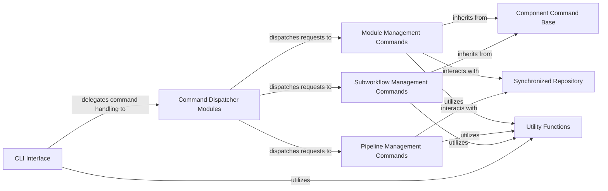

## Details

Abstract Components Overview of the nf-core tool.

### CLI Interface [[Expand]](./CLI_Interface.md)

This is the entry point of the application, responsible for parsing command-line arguments and dispatching them to the appropriate command handlers. It acts as the presentation layer, translating user input into actionable requests.

**Related Classes/Methods**:

- <a href="https://github.com/nf-core/tools/blob/main/nf_core/__main__.py" target="_blank" rel="noopener noreferrer">`nf_core.__main__`</a>

### Command Dispatcher Modules

This component represents the collection of modules responsible for defining and dispatching specific nf-core commands. The CLI Interface uses these modules to map command-line arguments to the appropriate execution logic for modules, pipelines, and subworkflows.

**Related Classes/Methods**:

- <a href="https://github.com/nf-core/tools/blob/main/nf_core/commands_modules.py" target="_blank" rel="noopener noreferrer">`nf_core.commands_modules`</a>

- <a href="https://github.com/nf-core/tools/blob/main/nf_core/commands_pipelines.py" target="_blank" rel="noopener noreferrer">`nf_core.commands_pipelines`</a>

- <a href="https://github.com/nf-core/tools/blob/main/nf_core/commands_subworkflows.py" target="_blank" rel="noopener noreferrer">`nf_core.commands_subworkflows`</a>

- <a href="https://github.com/nf-core/tools/blob/main/nf_core/commands_test_datasets.py" target="_blank" rel="noopener noreferrer">`nf_core.commands_test_datasets`</a>

### Module Management Commands

This component encompasses specific command implementations for managing nf-core modules, such as creation, installation, linting, listing, patching, and updating. These command classes inherit from Component Command Base or its specialized subclasses.

**Related Classes/Methods**:

- <a href="https://github.com/nf-core/tools/blob/main/nf_core/modules/create.py#L7-L33" target="_blank" rel="noopener noreferrer">`nf_core.modules.create.ModuleCreate` (7:33)</a>

- <a href="https://github.com/nf-core/tools/blob/main/nf_core/modules/install.py#L3-L25" target="_blank" rel="noopener noreferrer">`nf_core.modules.install.ModuleInstall` (3:25)</a>

- `nf_core.modules.lint.ModuleLint`

- <a href="https://github.com/nf-core/tools/blob/main/nf_core/modules/list.py#L9-L18" target="_blank" rel="noopener noreferrer">`nf_core.modules.list.ModuleList` (9:18)</a>

- <a href="https://github.com/nf-core/tools/blob/main/nf_core/modules/patch.py#L7-L9" target="_blank" rel="noopener noreferrer">`nf_core.modules.patch.ModulePatch` (7:9)</a>

- <a href="https://github.com/nf-core/tools/blob/main/nf_core/modules/remove.py#L7-L9" target="_blank" rel="noopener noreferrer">`nf_core.modules.remove.ModuleRemove` (7:9)</a>

- <a href="https://github.com/nf-core/tools/blob/main/nf_core/modules/update.py#L3-L33" target="_blank" rel="noopener noreferrer">`nf_core.modules.update.ModuleUpdate` (3:33)</a>

- <a href="https://github.com/nf-core/tools/blob/main/nf_core/modules/bump_versions.py" target="_blank" rel="noopener noreferrer">`nf_core.modules.bump_versions.ModuleVersionBumper`</a>

### Pipeline Management Commands

This component handles specific command implementations for operations related to nf-core pipelines, such as creation, downloading, linting, and schema validation. Unlike module and subworkflow commands, these commands do not directly inherit from Component Command Base.

**Related Classes/Methods**:

- <a href="https://github.com/nf-core/tools/blob/main/nf_core/pipelines/create/create.py" target="_blank" rel="noopener noreferrer">`nf_core.pipelines.create.create.PipelineCreate`</a>

- <a href="https://github.com/nf-core/tools/blob/main/nf_core/pipelines/download.py#L85-L1574" target="_blank" rel="noopener noreferrer">`nf_core.pipelines.download.DownloadWorkflow` (85:1574)</a>

- `nf_core.pipelines.lint.PipelineLint`

- <a href="https://github.com/nf-core/tools/blob/main/nf_core/pipelines/schema.py#L25-L1015" target="_blank" rel="noopener noreferrer">`nf_core.pipelines.schema.PipelineSchema` (25:1015)</a>

- <a href="https://github.com/nf-core/tools/blob/main/nf_core/pipelines/sync.py#L40-L503" target="_blank" rel="noopener noreferrer">`nf_core.pipelines.sync.PipelineSync` (40:503)</a>

### Subworkflow Management Commands

Similar to module management, this component focuses on specific command implementations for the creation, installation, linting, listing, patching, and updating of nf-core subworkflows. These command classes inherit from Component Command Base or its specialized subclasses.

**Related Classes/Methods**:

- <a href="https://github.com/nf-core/tools/blob/main/nf_core/subworkflows/create.py#L7-L23" target="_blank" rel="noopener noreferrer">`nf_core.subworkflows.create.SubworkflowCreate` (7:23)</a>

- <a href="https://github.com/nf-core/tools/blob/main/nf_core/subworkflows/install.py#L3-L25" target="_blank" rel="noopener noreferrer">`nf_core.subworkflows.install.SubworkflowInstall` (3:25)</a>

- `nf_core.subworkflows.lint.SubworkflowLint`

- <a href="https://github.com/nf-core/tools/blob/main/nf_core/subworkflows/list.py#L9-L18" target="_blank" rel="noopener noreferrer">`nf_core.subworkflows.list.SubworkflowList` (9:18)</a>

- <a href="https://github.com/nf-core/tools/blob/main/nf_core/subworkflows/patch.py#L7-L9" target="_blank" rel="noopener noreferrer">`nf_core.subworkflows.patch.SubworkflowPatch` (7:9)</a>

- <a href="https://github.com/nf-core/tools/blob/main/nf_core/subworkflows/remove.py#L7-L9" target="_blank" rel="noopener noreferrer">`nf_core.subworkflows.remove.SubworkflowRemove` (7:9)</a>

- <a href="https://github.com/nf-core/tools/blob/main/nf_core/subworkflows/update.py#L3-L33" target="_blank" rel="noopener noreferrer">`nf_core.subworkflows.update.SubworkflowUpdate` (3:33)</a>

### Component Command Base

This is a foundational class (ComponentCommand) providing shared logic and utilities specifically for managing nf-core components (modules and subworkflows). It implements common operations and interactions with the repository structure.

**Related Classes/Methods**:

- <a href="https://github.com/nf-core/tools/blob/main/nf_core/components/components_command.py#L16-L294" target="_blank" rel="noopener noreferrer">`nf_core.components.components_command.ComponentCommand` (16:294)</a>

### Utility Functions

This component provides a collection of general-purpose utility functions used across various parts of the nf-core tool, such as file I/O, GitHub API interactions, and configuration handling.

**Related Classes/Methods**:

- <a href="https://github.com/nf-core/tools/blob/main/nf_core/utils.py" target="_blank" rel="noopener noreferrer">`nf_core.utils`</a>

### Synchronized Repository

This component handles the synchronization and management of local copies of remote nf-core repositories (e.g., for modules or pipelines).

**Related Classes/Methods**:

- <a href="https://github.com/nf-core/tools/blob/main/nf_core/synced_repo.py#L59-L498" target="_blank" rel="noopener noreferrer">`nf_core.synced_repo.SyncedRepo` (59:498)</a>

### [FAQ](https://github.com/CodeBoarding/GeneratedOnBoardings/tree/main?tab=readme-ov-file#faq)