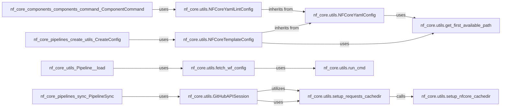

## Details

The `Core Utilities & Configuration` subsystem serves as the foundational layer for the `nf-core` project, providing essential general-purpose utility functions and robust configuration management capabilities. It embodies the project's architectural bias towards a modular, layered design with centralized configuration and efficient external integrations.

### nf_core.utils.NFCoreYamlConfig

This is the abstract base class for all YAML-based configurations within `nf-core`. It provides the core functionality for loading, parsing, and accessing data from YAML files, enabling the project's configuration-driven design. It ensures a consistent approach to managing application settings and dynamic parameters.

**Related Classes/Methods**:

- <a href="https://github.com/nf-core/tools/blob/main/nf_core/utils.py" target="_blank" rel="noopener noreferrer">`nf_core.utils.NFCoreYamlConfig`</a>

### nf_core.utils.NFCoreTemplateConfig

Specializes `NFCoreYamlConfig` to handle configurations specifically related to `nf-core` templates. This component is crucial for managing template-specific settings, ensuring the templating engine has access to necessary parameters for generating new pipelines or modules.

**Related Classes/Methods**:

- <a href="https://github.com/nf-core/tools/blob/main/nf_core/utils.py" target="_blank" rel="noopener noreferrer">`nf_core.utils.NFCoreTemplateConfig`</a>

### nf_core.utils.NFCoreYamlLintConfig

Another specialization of `NFCoreYamlConfig`, this class manages configurations for linting YAML files. It defines and applies linting rules, ensuring consistency and adherence to standards in configuration files across the project.

**Related Classes/Methods**:

- <a href="https://github.com/nf-core/tools/blob/main/nf_core/utils.py" target="_blank" rel="noopener noreferrer">`nf_core.utils.NFCoreYamlLintConfig`</a>

### nf_core.utils.GitHubAPISession

This component is responsible for managing authenticated and robust interactions with the GitHub API. It handles API requests, retries for transient errors, and various authentication methods. It's critical for features like pipeline updates, module management, and listing available resources from GitHub.

**Related Classes/Methods**:

- <a href="https://github.com/nf-core/tools/blob/main/nf_core/utils.py" target="_blank" rel="noopener noreferrer">`nf_core.utils.GitHubAPISession`</a>

### nf_core.utils.run_cmd

A low-level but essential utility function for executing arbitrary shell commands. This function provides the capability for the `nf-core` application to interact with the underlying operating system, enabling it to run external tools, Nextflow commands, or other system-level operations.

**Related Classes/Methods**:

- <a href="https://github.com/nf-core/tools/blob/main/nf_core/utils.py" target="_blank" rel="noopener noreferrer">`nf_core.utils.run_cmd`</a>

### nf_core.utils.fetch_wf_config

This utility function is specifically designed to fetch workflow configurations, often by executing external commands (likely Nextflow commands). It acts as an abstraction over `run_cmd` for a specific, common purpose, simplifying the retrieval of workflow-specific settings.

**Related Classes/Methods**:

- <a href="https://github.com/nf-core/tools/blob/main/nf_core/utils.py" target="_blank" rel="noopener noreferrer">`nf_core.utils.fetch_wf_config`</a>

### nf_core.utils.setup_nfcore_cachedir

A general utility for setting up and managing the primary `nf-core` data caching directory. This function ensures that the application has a designated, persistent location for storing various cached data, contributing to overall performance and efficiency by reducing redundant computations or network calls.

**Related Classes/Methods**:

- <a href="https://github.com/nf-core/tools/blob/main/nf_core/utils.py" target="_blank" rel="noopener noreferrer">`nf_core.utils.setup_nfcore_cachedir`</a>

### nf_core.utils.setup_requests_cachedir

Manages the setup and configuration of a caching directory specifically for HTTP requests made by the `requests` library. This improves performance by storing frequently accessed web data locally, reducing the need for repeated network calls, especially for GitHub API interactions.

**Related Classes/Methods**:

- <a href="https://github.com/nf-core/tools/blob/main/nf_core/utils.py" target="_blank" rel="noopener noreferrer">`nf_core.utils.setup_requests_cachedir`</a>

### nf_core.utils.get_first_available_path

This utility function helps in determining the first existing path from a given list of potential file or directory paths. This is useful for flexible file and directory lookups, allowing the application to try multiple locations for a resource or configuration file.

**Related Classes/Methods**:

- <a href="https://github.com/nf-core/tools/blob/main/nf_core/utils.py" target="_blank" rel="noopener noreferrer">`nf_core.utils.get_first_available_path`</a>

### [FAQ](https://github.com/CodeBoarding/GeneratedOnBoardings/tree/main?tab=readme-ov-file#faq)