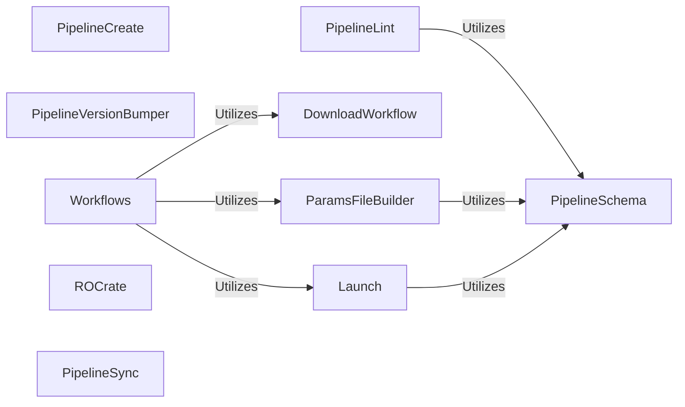

## Details

Abstract Components Overview of Nextflow Pipelines

### PipelineCreate

Orchestrates the creation of new Nextflow pipelines. This involves interactive prompts for pipeline details, generating the initial directory structure, and populating template files based on user input.

**Related Classes/Methods**:

- <a href="https://github.com/nf-core/tools/blob/main/nf_core/pipelines/create/create.py" target="_blank" rel="noopener noreferrer">`nf_core.pipelines.create.create`</a>

### PipelineVersionBumper

Manages the process of updating the version of an existing Nextflow pipeline. This includes modifying relevant files (e.g., nextflow.config, pyproject.toml) and ensuring version consistency across the pipeline's metadata.

**Related Classes/Methods**:

- <a href="https://github.com/nf-core/tools/blob/main/nf_core/pipelines/bump_version.py" target="_blank" rel="noopener noreferrer">`nf_core.pipelines.bump_version`</a>

### PipelineLint

Performs comprehensive linting and validation checks on Nextflow pipelines to ensure adherence to nf-core guidelines, best practices, and schema definitions. It aggregates various sub-checks for code quality, configuration, and schema compliance.

**Related Classes/Methods**:

### DownloadWorkflow

Handles the downloading of Nextflow pipelines from remote repositories (e.g., GitHub), including specific versions or branches. It manages the local caching and integrity of downloaded pipelines, ensuring they are ready for use.

**Related Classes/Methods**:

- <a href="https://github.com/nf-core/tools/blob/main/nf_core/pipelines/download.py" target="_blank" rel="noopener noreferrer">`nf_core.pipelines.download`</a>

### ParamsFileBuilder

Generates parameter files (e.g., params.json, params.yaml) for Nextflow pipelines based on their defined schemas. This component simplifies pipeline configuration by providing a structured way to define and validate input parameters.

**Related Classes/Methods**:

- <a href="https://github.com/nf-core/tools/blob/main/nf_core/pipelines/params_file.py" target="_blank" rel="noopener noreferrer">`nf_core.pipelines.params_file`</a>

### Launch

Manages the launching and execution of Nextflow pipelines. It integrates with the schema component to validate parameters before execution, ensuring that the pipeline receives valid inputs.

**Related Classes/Methods**:

- <a href="https://github.com/nf-core/tools/blob/main/nf_core/pipelines/launch.py" target="_blank" rel="noopener noreferrer">`nf_core.pipelines.launch`</a>

### Workflows

Provides functionality to list available Nextflow pipelines, both locally (discovered in the current directory or specified paths) and from remote nf-core repositories. It acts as an entry point for various pipeline-related operations.

**Related Classes/Methods**:

- <a href="https://github.com/nf-core/tools/blob/main/nf_core/pipelines/list.py" target="_blank" rel="noopener noreferrer">`nf_core.pipelines.list`</a>

### ROCrate

Handles the generation and management of Research Object (RO) Crates for Nextflow pipelines. RO-Crates package research data, code, and metadata into a single, FAIR-compliant archive, enhancing reproducibility and sharing.

**Related Classes/Methods**:

- <a href="https://github.com/nf-core/tools/blob/main/nf_core/pipelines/rocrate.py" target="_blank" rel="noopener noreferrer">`nf_core.pipelines.rocrate`</a>

### PipelineSync

Synchronizes local Nextflow pipelines with their upstream nf-core templates. This allows pipeline developers to easily update their custom pipelines with the latest changes and features from the official nf-core templates.

**Related Classes/Methods**:

- <a href="https://github.com/nf-core/tools/blob/main/nf_core/pipelines/sync.py" target="_blank" rel="noopener noreferrer">`nf_core.pipelines.sync`</a>

### PipelineSchema

Defines, validates, builds, and documents schemas for Nextflow pipeline parameters. This is a critical component for ensuring that pipelines receive valid inputs, generating user-friendly documentation, and enabling automated parameter file generation.

**Related Classes/Methods**:

- <a href="https://github.com/nf-core/tools/blob/main/nf_core/pipelines/schema.py" target="_blank" rel="noopener noreferrer">`nf_core.pipelines.schema`</a>

### [FAQ](https://github.com/CodeBoarding/GeneratedOnBoardings/tree/main?tab=readme-ov-file#faq)