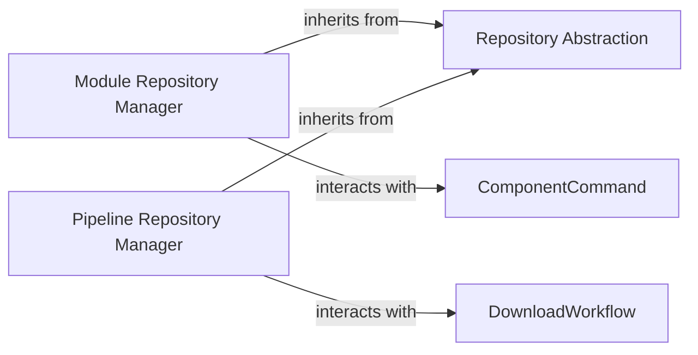

## Details

The `Repository & Sync Services` subsystem is a cornerstone of `nf-core`, providing the essential capabilities for interacting with Git repositories to manage both `nf-core` modules and pipelines. It adheres to the project's architectural bias by maintaining a clear separation of concerns, with a foundational abstraction layer for Git operations and specialized components built upon it.

### Repository Abstraction

This is the foundational component, embodied by the `nf_core.synced_repo.SyncedRepo` class. It provides generic, low-level functionalities for interacting with Git repositories. Its responsibilities include cloning repositories, fetching updates, checking out specific branches or commits (SHAs), and verifying the integrity and state of the local repository against its remote counterpart. It acts as the base class for all specialized repository managers within `nf-core`, ensuring consistent and reliable Git interactions across the application.

**Related Classes/Methods**:

- <a href="https://github.com/nf-core/tools/blob/main/nf_core/synced_repo.py#L59-L498" target="_blank" rel="noopener noreferrer">`nf_core.synced_repo.SyncedRepo` (59:498)</a>

### Module Repository Manager

This component, represented by `nf_core.modules.modules_repo.ModulesRepo`, extends the `Repository Abstraction` (`nf_core.synced_repo.SyncedRepo`) to specifically manage `nf-core` modules. It provides specialized functionalities for setting up, installing, updating, and verifying modules, leveraging the underlying Git synchronization capabilities inherited from its parent class. It is a critical component for all `nf-core modules` CLI commands, ensuring that module-specific operations are handled correctly within the Git repository context.

**Related Classes/Methods**:

- <a href="https://github.com/nf-core/tools/blob/main/nf_core/modules/modules_repo.py#L20-L153" target="_blank" rel="noopener noreferrer">`nf_core.modules.modules_repo.ModulesRepo` (20:153)</a>

### Pipeline Repository Manager

Similar to the `Module Repository Manager`, this component, implemented as `nf_core.pipelines.download.WorkflowRepo`, extends the `Repository Abstraction` (`nf_core.synced_repo.SyncedRepo`) but focuses on managing `nf-core` pipelines. Its primary responsibility is to facilitate the downloading and checking out of specific pipeline versions from remote Git repositories. This component is essential for the `nf-core download` command, enabling users to obtain and manage `nf-core` pipelines locally.

**Related Classes/Methods**:

- <a href="https://github.com/nf-core/tools/blob/main/nf_core/pipelines/download.py#L1577-L1850" target="_blank" rel="noopener noreferrer">`nf_core.pipelines.download.WorkflowRepo` (1577:1850)</a>

### [FAQ](https://github.com/CodeBoarding/GeneratedOnBoardings/tree/main?tab=readme-ov-file#faq)