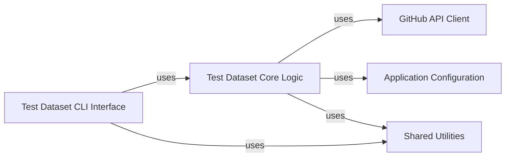

## Details

This subsystem facilitates the listing, searching, and potentially downloading of test datasets required for pipeline and component testing. It primarily interacts with remote GitHub repositories to retrieve dataset information and download URLs.

### Test Dataset CLI Interface

This component serves as the user-facing interface for the test data management subsystem. It provides the command-line entry points for listing and searching available test datasets, translating user commands into calls to the core logic. It embodies the Command Pattern by encapsulating user actions into distinct commands.

**Related Classes/Methods**:

- <a href="https://github.com/nf-core/tools/blob/main/nf_core/test_datasets/list.py#L1-L999999" target="_blank" rel="noopener noreferrer">`nf_core.test_datasets.list` (1:999999)</a>

- <a href="https://github.com/nf-core/tools/blob/main/nf_core/test_datasets/search.py#L1-L999999" target="_blank" rel="noopener noreferrer">`nf_core.test_datasets.search` (1:999999)</a>

### Test Dataset Core Logic

This is the central application logic component for test data management. It encapsulates the business rules and data access mechanisms for interacting with remote GitHub repositories. Its responsibilities include constructing GitHub API requests, parsing responses, and extracting relevant information about test datasets (e.g., branches, file lists, download URLs). This component represents the core domain logic of the subsystem.

**Related Classes/Methods**:

- <a href="https://github.com/nf-core/tools/blob/main/nf_core/test_datasets/test_datasets_utils.py#L1-L999999" target="_blank" rel="noopener noreferrer">`nf_core.test_datasets.test_datasets_utils` (1:999999)</a>

### GitHub API Client

This shared infrastructure component provides a robust and centralized mechanism for authenticating and managing HTTP requests to the GitHub API. It handles API tokens, rate limiting, and general network communication, ensuring efficient and authorized access to GitHub resources. It acts as a dedicated External API Integration layer.

**Related Classes/Methods**:

- <a href="https://github.com/nf-core/tools/blob/main/nf_core/utils.py#L1-L999999" target="_blank" rel="noopener noreferrer">`nf_core.utils.GitHubAPISession` (1:999999)</a>

- <a href="https://github.com/nf-core/tools/blob/main/nf_core/utils.py#L1-L999999" target="_blank" rel="noopener noreferrer">`nf_core.utils.GithubApiEndpoints` (1:999999)</a>

### Application Configuration

This shared infrastructure component is responsible for loading, parsing, and providing access to various YAML-based configurations used across the nf-core project. It ensures that the application can dynamically adapt its behavior based on predefined settings and user preferences, supporting a Configuration-driven Design.

**Related Classes/Methods**:

- <a href="https://github.com/nf-core/tools/blob/main/nf_core/utils.py#L1-L999999" target="_blank" rel="noopener noreferrer">`nf_core.utils.NFCoreYamlConfig` (1:999999)</a>

- <a href="https://github.com/nf-core/tools/blob/main/nf_core/utils.py#L1-L999999" target="_blank" rel="noopener noreferrer">`nf_core.utils.NFCoreTemplateConfig` (1:999999)</a>

- <a href="https://github.com/nf-core/tools/blob/main/nf_core/utils.py#L1-L999999" target="_blank" rel="noopener noreferrer">`nf_core.utils.NFCoreYamlLintConfig` (1:999999)</a>

### Shared Utilities

This broad, shared infrastructure component encompasses a collection of common utility functions and helper methods that are widely used across the entire nf-core project. This includes functionalities like file system operations, path resolution, logging, string manipulation, and general data processing. It promotes code reusability across different components.

**Related Classes/Methods**:

- <a href="https://github.com/nf-core/tools/blob/main/nf_core/utils.py#L1-L999999" target="_blank" rel="noopener noreferrer">`nf_core.utils` (1:999999)</a>

### [FAQ](https://github.com/CodeBoarding/GeneratedOnBoardings/tree/main?tab=readme-ov-file#faq)