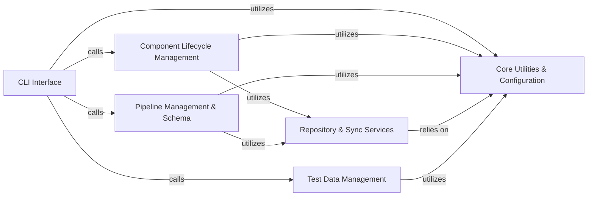

## Details

The `tools` project, functioning as a CLI Application, SDK/Framework Helper Tool, and Developer Tool, exhibits a modular and layered architecture. The core components are designed to manage Nextflow pipelines and reusable components (modules and subworkflows), with clear separation between the user interface, domain logic, and underlying utility services.

### CLI Interface [[Expand]](./CLI_Interface.md)

The primary user interaction layer, responsible for parsing command-line arguments and dispatching requests to the appropriate application logic. It acts as the presentation layer, translating user commands into calls to the core functionalities.

**Related Classes/Methods**:

- <a href="https://github.com/nf-core/tools/blob/main/nf_core/__main__.py" target="_blank" rel="noopener noreferrer">`nf_core.__main__`</a>

- <a href="https://github.com/nf-core/tools/blob/main/nf_core/commands_modules.py" target="_blank" rel="noopener noreferrer">`nf_core.commands_modules`</a>

- <a href="https://github.com/nf-core/tools/blob/main/nf_core/commands_pipelines.py" target="_blank" rel="noopener noreferrer">`nf_core.commands_pipelines`</a>

- <a href="https://github.com/nf-core/tools/blob/main/nf_core/commands_subworkflows.py" target="_blank" rel="noopener noreferrer">`nf_core.commands_subworkflows`</a>

- <a href="https://github.com/nf-core/tools/blob/main/nf_core/commands_test_datasets.py" target="_blank" rel="noopener noreferrer">`nf_core.commands_test_datasets`</a>

### Component Lifecycle Management

Manages the full lifecycle of reusable Nextflow components (modules and subworkflows), including creation, installation, updating, removal, listing, information retrieval, patching, version bumping, and linting. It provides a unified interface for managing these workflow building blocks.

**Related Classes/Methods**:

- <a href="https://github.com/nf-core/tools/blob/main/nf_core/components/components_command.py" target="_blank" rel="noopener noreferrer">`nf_core.components.components_command`</a>

- <a href="https://github.com/nf-core/tools/blob/main/nf_core/components/create.py" target="_blank" rel="noopener noreferrer">`nf_core.components.create.ComponentCreate`</a>

- <a href="https://github.com/nf-core/tools/blob/main/nf_core/components/install.py#L29-L348" target="_blank" rel="noopener noreferrer">`nf_core.components.install.ComponentInstall` (29:348)</a>

- <a href="https://github.com/nf-core/tools/blob/main/nf_core/components/update.py#L25-L1021" target="_blank" rel="noopener noreferrer">`nf_core.components.update.ComponentUpdate` (25:1021)</a>

- <a href="https://github.com/nf-core/tools/blob/main/nf_core/components/remove.py#L17-L188" target="_blank" rel="noopener noreferrer">`nf_core.components.remove.ComponentRemove` (17:188)</a>

- <a href="https://github.com/nf-core/tools/blob/main/nf_core/components/list.py#L14-L175" target="_blank" rel="noopener noreferrer">`nf_core.components.list.ComponentList` (14:175)</a>

- <a href="https://github.com/nf-core/tools/blob/main/nf_core/components/info.py#L23-L377" target="_blank" rel="noopener noreferrer">`nf_core.components.info.ComponentInfo` (23:377)</a>

- <a href="https://github.com/nf-core/tools/blob/main/nf_core/components/patch.py#L16-L233" target="_blank" rel="noopener noreferrer">`nf_core.components.patch.ComponentPatch` (16:233)</a>

- `nf_core.components.lint.ComponentLint`

- <a href="https://github.com/nf-core/tools/blob/main/nf_core/modules/create.py#L7-L33" target="_blank" rel="noopener noreferrer">`nf_core.modules.create.ModuleCreate` (7:33)</a>

- <a href="https://github.com/nf-core/tools/blob/main/nf_core/modules/install.py#L3-L25" target="_blank" rel="noopener noreferrer">`nf_core.modules.install.ModuleInstall` (3:25)</a>

- `nf_core.modules.lint.ModuleLint`

- <a href="https://github.com/nf-core/tools/blob/main/nf_core/subworkflows/create.py#L7-L23" target="_blank" rel="noopener noreferrer">`nf_core.subworkflows.create.SubworkflowCreate` (7:23)</a>

- <a href="https://github.com/nf-core/tools/blob/main/nf_core/subworkflows/install.py#L3-L25" target="_blank" rel="noopener noreferrer">`nf_core.subworkflows.install.SubworkflowInstall` (3:25)</a>

- `nf_core.subworkflows.lint.SubworkflowLint`

- <a href="https://github.com/nf-core/tools/blob/main/nf_core/modules/bump_versions.py" target="_blank" rel="noopener noreferrer">`nf_core.modules.bump_versions.ModuleVersionBumper`</a>

### Pipeline Management & Schema [[Expand]](./Pipeline_Management_Schema.md)

Handles the complete lifecycle of Nextflow pipelines, encompassing creation, version bumping, linting, downloading, parameter file generation, launching, listing, RO-Crate generation, and synchronization. It also includes the definition, validation, building, and documentation of pipeline schemas to ensure parameter adherence.

**Related Classes/Methods**:

- <a href="https://github.com/nf-core/tools/blob/main/nf_core/pipelines/create/create.py" target="_blank" rel="noopener noreferrer">`nf_core.pipelines.create.create.PipelineCreate`</a>

- <a href="https://github.com/nf-core/tools/blob/main/nf_core/pipelines/bump_version.py" target="_blank" rel="noopener noreferrer">`nf_core.pipelines.bump_version`</a>

- `nf_core.pipelines.lint.PipelineLint`

- <a href="https://github.com/nf-core/tools/blob/main/nf_core/pipelines/download.py#L85-L1574" target="_blank" rel="noopener noreferrer">`nf_core.pipelines.download.DownloadWorkflow` (85:1574)</a>

- <a href="https://github.com/nf-core/tools/blob/main/nf_core/pipelines/params_file.py#L73-L287" target="_blank" rel="noopener noreferrer">`nf_core.pipelines.params_file.ParamsFileBuilder` (73:287)</a>

- <a href="https://github.com/nf-core/tools/blob/main/nf_core/pipelines/launch.py#L23-L739" target="_blank" rel="noopener noreferrer">`nf_core.pipelines.launch.Launch` (23:739)</a>

- <a href="https://github.com/nf-core/tools/blob/main/nf_core/pipelines/list.py#L75-L274" target="_blank" rel="noopener noreferrer">`nf_core.pipelines.list.Workflows` (75:274)</a>

- <a href="https://github.com/nf-core/tools/blob/main/nf_core/pipelines/rocrate.py#L60-L363" target="_blank" rel="noopener noreferrer">`nf_core.pipelines.rocrate.ROCrate` (60:363)</a>

- <a href="https://github.com/nf-core/tools/blob/main/nf_core/pipelines/sync.py#L40-L503" target="_blank" rel="noopener noreferrer">`nf_core.pipelines.sync.PipelineSync` (40:503)</a>

- <a href="https://github.com/nf-core/tools/blob/main/nf_core/pipelines/create_logo.py#L12-L111" target="_blank" rel="noopener noreferrer">`nf_core.pipelines.create_logo` (12:111)</a>

- <a href="https://github.com/nf-core/tools/blob/main/nf_core/utils.py" target="_blank" rel="noopener noreferrer">`nf_core.utils.Pipeline`</a>

- <a href="https://github.com/nf-core/tools/blob/main/nf_core/pipelines/schema.py#L25-L1015" target="_blank" rel="noopener noreferrer">`nf_core.pipelines.schema.PipelineSchema` (25:1015)</a>

- <a href="https://github.com/nf-core/tools/blob/main/nf_core/pipelines/create/utils.py#L39-L89" target="_blank" rel="noopener noreferrer">`nf_core.pipelines.create.utils.CreateConfig` (39:89)</a>

### Repository & Sync Services [[Expand]](./Repository_Sync_Services.md)

Provides core functionalities for interacting with Git repositories, including cloning, checking out branches/commits, and managing local repository states. It also encapsulates the synchronization logic for keeping local repositories up-to-date with remote sources.

**Related Classes/Methods**:

- <a href="https://github.com/nf-core/tools/blob/main/nf_core/synced_repo.py#L59-L498" target="_blank" rel="noopener noreferrer">`nf_core.synced_repo.SyncedRepo` (59:498)</a>

- <a href="https://github.com/nf-core/tools/blob/main/nf_core/modules/modules_repo.py#L20-L153" target="_blank" rel="noopener noreferrer">`nf_core.modules.modules_repo.ModulesRepo` (20:153)</a>

- <a href="https://github.com/nf-core/tools/blob/main/nf_core/pipelines/download.py#L1577-L1850" target="_blank" rel="noopener noreferrer">`nf_core.pipelines.download.WorkflowRepo` (1577:1850)</a>

### Core Utilities & Configuration [[Expand]](./Core_Utilities_Configuration.md)

A foundational layer offering general-purpose utility functions, including file I/O operations, loading and managing application configurations (YAML/JSON), interacting with the GitHub API, executing external commands, and other common helper functions used across the application.

**Related Classes/Methods**:

- <a href="https://github.com/nf-core/tools/blob/main/nf_core/utils.py" target="_blank" rel="noopener noreferrer">`nf_core.utils`</a>

- <a href="https://github.com/nf-core/tools/blob/main/nf_core/utils.py" target="_blank" rel="noopener noreferrer">`nf_core.utils.NFCoreYamlConfig`</a>

- <a href="https://github.com/nf-core/tools/blob/main/nf_core/utils.py" target="_blank" rel="noopener noreferrer">`nf_core.utils.NFCoreTemplateConfig`</a>

- <a href="https://github.com/nf-core/tools/blob/main/nf_core/utils.py" target="_blank" rel="noopener noreferrer">`nf_core.utils.NFCoreYamlLintConfig`</a>

- <a href="https://github.com/nf-core/tools/blob/main/nf_core/utils.py" target="_blank" rel="noopener noreferrer">`nf_core.utils.GitHubAPISession`</a>

### Test Data Management [[Expand]](./Test_Data_Management.md)

Facilitates the listing, searching, and potentially downloading of test datasets required for pipeline and component testing. It primarily interacts with remote GitHub repositories to retrieve dataset information and download URLs.

**Related Classes/Methods**:

- <a href="https://github.com/nf-core/tools/blob/main/nf_core/test_datasets/list.py" target="_blank" rel="noopener noreferrer">`nf_core.test_datasets.list`</a>

- <a href="https://github.com/nf-core/tools/blob/main/nf_core/test_datasets/search.py" target="_blank" rel="noopener noreferrer">`nf_core.test_datasets.search`</a>

- <a href="https://github.com/nf-core/tools/blob/main/nf_core/test_datasets/test_datasets_utils.py" target="_blank" rel="noopener noreferrer">`nf_core.test_datasets.test_datasets_utils`</a>

### [FAQ](https://github.com/CodeBoarding/GeneratedOnBoardings/tree/main?tab=readme-ov-file#faq)