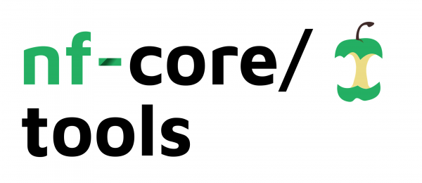

#  <!-- omit in toc -->

[](https://github.com/nf-core/tools/actions?query=workflow%3A%22Python+tests%22+branch%3Amaster)
[](https://codecov.io/gh/nf-core/tools)
[](https://github.com/psf/black)

[](https://bioconda.github.io/recipes/nf-core/README.html)
[](https://pypi.org/project/nf-core/)
[](https://nfcore.slack.com/channels/tools)

A python package with helper tools for the nf-core community.

> **Read this documentation on the nf-core website: [https://nf-co.re/tools](https://nf-co.re/tools)**

## Table of contents <!-- omit in toc -->

* [`nf-core` tools installation](#installation)
* [`nf-core list` - List available pipelines](#listing-pipelines)
* [`nf-core launch` - Run a pipeline with interactive parameter prompts](#launch-a-pipeline)
* [`nf-core download` - Download pipeline for offline use](#downloading-pipelines-for-offline-use)
* [`nf-core licences` - List software licences in a pipeline](#pipeline-software-licences)
* [`nf-core create` - Create a new pipeline with the nf-core template](#creating-a-new-pipeline)
* [`nf-core lint` - Check pipeline code against nf-core guidelines](#linting-a-workflow)
* [`nf-core schema` - Work with pipeline schema files](#pipeline-schema)
* [`nf-core bump-version` - Update nf-core pipeline version number](#bumping-a-pipeline-version-number)
* [`nf-core sync` - Synchronise pipeline TEMPLATE branches](#sync-a-pipeline-with-the-template)
* [`nf-core modules` - commands for dealing with DSL2 modules](#modules)
    * [`modules list` - List available modules](#list-modules)
        * [`modules list remote` - List remote modules](#list-remote-modules)
        * [`modules list local` - List installed modules](#list-installed-modules)
    * [`modules install` - Install or update modules in pipeline](#install-or-update-modules-in-a-pipeline)
    * [`modules remove` - Remove a module from a pipeline](#remove-a-module-from-a-pipeline)
    * [`modules create` - Create a module from the template](#create-a-new-module)
    * [`modules create-test-yml` - Create the `test.yml` file for a module](#create-a-module-test-config-file)
    * [`modules lint` - Check a module against nf-core guidelines](#check-a-module-against-nf-core-guidelines)
    * [`modules bump-versions` - Bump software versions of modules](#bump-bioconda-and-container-versions-of-modules-in)

* [Citation](#citation)

The nf-core tools package is written in Python and can be imported and used within other packages.
For documentation of the internal Python functions, please refer to the [Tools Python API docs](https://nf-co.re/tools-docs/).

## Installation

### Bioconda

You can install `nf-core/tools` from [bioconda](https://bioconda.github.io/recipes/nf-core/README.html).

First, install conda and configure the channels to use bioconda
(see the [bioconda documentation](https://bioconda.github.io/user/install.html)).
Then, just run the conda installation command:

```bash
conda install nf-core
```

Alternatively, you can create a new environment with both nf-core/tools and nextflow:

```bash
conda create --name nf-core python=3.7 nf-core nextflow
conda activate nf-core
```

### Python Package Index

`nf-core/tools` can also be installed from [PyPI](https://pypi.python.org/pypi/nf-core/) using pip as follows:

```bash
pip install nf-core
```

### Docker image

There is a docker image that you can use to run `nf-core/tools` that has all of the requirements packaged (including Nextflow) and so should work out of the box. It is called [`nfcore/tools`](https://hub.docker.com/r/nfcore/tools) _**(NB: no hyphen!)**_

You can use this container on the command line as follows:

```bash
docker run -itv `pwd`:`pwd` -w `pwd` -u $(id -u):$(id -g) nfcore/tools
```

* `-i` and `-t` are needed for the interactive cli prompts to work (this tells Docker to use a pseudo-tty with stdin attached)
* The `-v` argument tells Docker to bind your current working directory (`pwd`) to the same path inside the container, so that files created there will be saved to your local file system outside of the container.
* `-w` sets the working directory in the container to this path, so that it's the same as your working directory outside of the container.
* `-u` sets your local user account as the user inside the container, so that any files created have the correct ownership permissions

After the above base command, you can use the regular command line flags that you would use with other types of installation.
For example, to launch the `viralrecon` pipeline:

```bash
docker run -itv `pwd`:`pwd` -w `pwd` -u $(id -u):$(id -g) nfcore/tools launch viralrecon -r 1.1.0
```

If you use `$NXF_SINGULARITY_CACHEDIR` for downloads, you'll also need to make this folder and environment variable available to the continer:

```bash
docker run -itv `pwd`:`pwd` -w `pwd` -u $(id -u):$(id -g) -v $NXF_SINGULARITY_CACHEDIR:$NXF_SINGULARITY_CACHEDIR -e NXF_SINGULARITY_CACHEDIR nfcore/tools launch viralrecon -r 1.1.0
```

#### Docker bash alias

The above base command is a bit of a mouthful to type, to say the least.
To make it easier to use, we highly recommend adding the following bash alias to your `~/.bashrc` file:

```bash
alias nf-core="docker run -itv `pwd`:`pwd` -w `pwd` -u $(id -u):$(id -g) nfcore/tools"
```

Once applied (you may need to reload your shell) you can just use the `nf-core` command instead:

```bash
nf-core list
```

#### Docker versions

You can use docker image tags to specify the version you would like to use. For example, `nfcore/tools:dev` for the latest development version of the code, or `nfcore/tools:1.14` for version `1.14` of tools.
If you omit this, it will default to `:latest`, which should be the latest stable release.

If you need a specific version of Nextflow inside the container, you can build an image yourself.
Clone the repo locally and check out whatever version of nf-core/tools that you need.
Then build using the `--build-arg NXF_VER` flag as follows:

```bash
docker build -t nfcore/tools:dev . --build-arg NXF_VER=20.04.0
```

### Development version

If you would like the latest development version of tools, the command is:

```bash
pip install --upgrade --force-reinstall git+https://github.com/nf-core/tools.git@dev
```

If you intend to make edits to the code, first make a fork of the repository and then clone it locally.
Go to the cloned directory and install with pip (also installs development requirements):

```bash
pip install --upgrade -r requirements-dev.txt -e .
```

### Using a specific Python interpreter

If you prefer, you can also run tools with a specific Python interpreter.
The command line usage and flags are then exactly the same as if you ran with the `nf-core` command.
Note that the module is `nf_core` with an underscore, not a hyphen like the console command.

For example:

```bash
python -m nf_core --help
python3 -m nf_core list
~/my_env/bin/python -m nf_core create --name mypipeline --description "This is a new skeleton pipeline"
```

### Using with your own Python scripts

The tools functionality is written in such a way that you can import it into your own scripts.
For example, if you would like to get a list of all available nf-core pipelines:

```python
import nf_core.list
wfs = nf_core.list.Workflows()
wfs.get_remote_workflows()
for wf in wfs.remote_workflows:
    print(wf.full_name)
```

Please see [https://nf-co.re/tools-docs/](https://nf-co.re/tools-docs/) for the function documentation.

### Automatic version check

nf-core/tools automatically checks the web to see if there is a new version of nf-core/tools available.
If you would prefer to skip this check, set the environment variable `NFCORE_NO_VERSION_CHECK`. For example:

```bash
export NFCORE_NO_VERSION_CHECK=1
```

## Listing pipelines

The command `nf-core list` shows all available nf-core pipelines along with their latest version,  when that was published and how recently the pipeline code was pulled to your local system (if at all).

An example of the output from the command is as follows:

```console
$ nf-core list

                                          ,--./,-.
          ___     __   __   __   ___     /,-._.--~\
    |\ | |__  __ /  ` /  \ |__) |__         }  {
    | \| |       \__, \__/ |  \ |___     \`-._,-`-,
                                          `._,._,'

    nf-core/tools version 2.0

┏━━━━━━━━━━━━━━━━━━━┳━━━━━━━┳━━━━━━━━━━━━━━━━┳━━━━━━━━━━━━━━━┳━━━━━━━━━━━━━━┳━━━━━━━━━━━━━━━━━━━━━━━┓
┃ Pipeline Name     ┃ Stars ┃ Latest Release ┃      Released ┃  Last Pulled ┃ Have latest release?  ┃
┡━━━━━━━━━━━━━━━━━━━╇━━━━━━━╇━━━━━━━━━━━━━━━━╇━━━━━━━━━━━━━━━╇━━━━━━━━━━━━━━╇━━━━━━━━━━━━━━━━━━━━━━━┩
│ rnafusion         │    45 │          1.2.0 │   2 weeks ago │            - │ -                     │
│ hic               │    17 │          1.2.1 │   3 weeks ago │ 4 months ago │ No (v1.1.0)           │
│ chipseq           │    56 │          1.2.0 │   4 weeks ago │  4 weeks ago │ No (dev - bfe7eb3)    │
│ atacseq           │    40 │          1.2.0 │   4 weeks ago │  6 hours ago │ No (master - 79bc7c2) │
│ viralrecon        │    20 │          1.1.0 │  1 months ago │ 1 months ago │ Yes (v1.1.0)          │
│ sarek             │    59 │          2.6.1 │  1 months ago │            - │ -                     │
[..truncated..]
```

To narrow down the list, supply one or more additional keywords to filter the pipelines based on matches in titles, descriptions and topics:

```console
$ nf-core list rna rna-seq

                                          ,--./,-.
          ___     __   __   __   ___     /,-._.--~\
    |\ | |__  __ /  ` /  \ |__) |__         }  {
    | \| |       \__, \__/ |  \ |___     \`-._,-`-,
                                          `._,._,'

    nf-core/tools version 2.0

┏━━━━━━━━━━━━━━━┳━━━━━━━┳━━━━━━━━━━━━━━━━┳━━━━━━━━━━━━━━┳━━━━━━━━━━━━━┳━━━━━━━━━━━━━━━━━━━━━━┓
┃ Pipeline Name ┃ Stars ┃ Latest Release ┃     Released ┃ Last Pulled ┃ Have latest release? ┃
┡━━━━━━━━━━━━━━━╇━━━━━━━╇━━━━━━━━━━━━━━━━╇━━━━━━━━━━━━━━╇━━━━━━━━━━━━━╇━━━━━━━━━━━━━━━━━━━━━━┩
│ dualrnaseq    │     3 │          1.0.0 │ 1 months ago │           - │ -                    │
│ rnaseq        │   304 │            3.0 │ 3 months ago │ 1 years ago │ No (v1.4.2)          │
│ rnafusion     │    56 │          1.2.0 │ 8 months ago │ 2 years ago │ No (v1.0.1)          │
│ smrnaseq      │    18 │          1.0.0 │  1 years ago │           - │ -                    │
│ circrna       │     1 │            dev │            - │           - │ -                    │
│ lncpipe       │    18 │            dev │            - │           - │ -                    │
│ scflow        │     2 │            dev │            - │           - │ -                    │
└───────────────┴───────┴────────────────┴──────────────┴─────────────┴──────────────────────┘
```

You can sort the results by latest release (`-s release`, default),
when you last pulled a local copy (`-s pulled`),
alphabetically (`-s name`),
or number of GitHub stars (`-s stars`).

```console
$ nf-core list -s stars

                                          ,--./,-.
          ___     __   __   __   ___     /,-._.--~\
    |\ | |__  __ /  ` /  \ |__) |__         }  {
    | \| |       \__, \__/ |  \ |___     \`-._,-`-,
                                          `._,._,'

    nf-core/tools version 2.0

┏━━━━━━━━━━━━━━━━━━━┳━━━━━━━┳━━━━━━━━━━━━━━━━┳━━━━━━━━━━━━━━━┳━━━━━━━━━━━━━━┳━━━━━━━━━━━━━━━━━━━━━━━┓
┃ Pipeline Name     ┃ Stars ┃ Latest Release ┃      Released ┃  Last Pulled ┃ Have latest release?  ┃
┡━━━━━━━━━━━━━━━━━━━╇━━━━━━━╇━━━━━━━━━━━━━━━━╇━━━━━━━━━━━━━━━╇━━━━━━━━━━━━━━╇━━━━━━━━━━━━━━━━━━━━━━━┩
│ rnaseq            │   207 │          1.4.2 │  9 months ago │   5 days ago │ Yes (v1.4.2)          │
│ sarek             │    59 │          2.6.1 │  1 months ago │            - │ -                     │
│ chipseq           │    56 │          1.2.0 │   4 weeks ago │  4 weeks ago │ No (dev - bfe7eb3)    │
│ methylseq         │    47 │            1.5 │  4 months ago │            - │ -                     │
│ rnafusion         │    45 │          1.2.0 │   2 weeks ago │            - │ -                     │
│ ampliseq          │    41 │          1.1.2 │  7 months ago │            - │ -                     │
│ atacseq           │    40 │          1.2.0 │   4 weeks ago │  6 hours ago │ No (master - 79bc7c2) │
[..truncated..]
```

To return results as JSON output for downstream use, use the `--json` flag.

Archived pipelines are not returned by default. To include them, use the `--show_archived` flag.

## Launch a pipeline

Some nextflow pipelines have a considerable number of command line flags that can be used.
To help with this, you can use the `nf-core launch` command
You can choose between a web-based graphical interface or an interactive command-line wizard tool to enter the pipeline parameters for your run.
Both interfaces show documentation alongside each parameter and validate your inputs.

The tool uses the `nextflow_schema.json` file from a pipeline to give parameter descriptions, defaults and grouping.
If no file for the pipeline is found, one will be automatically generated at runtime.

Nextflow `params` variables are saved in to a JSON file called `nf-params.json` and used by nextflow with the `-params-file` flag.
This makes it easier to reuse these in the future.

The command takes one argument - either the name of an nf-core pipeline which will be pulled automatically,
or the path to a directory containing a Nextflow pipeline _(can be any pipeline, doesn't have to be nf-core)_.

```console
$ nf-core launch rnaseq

                                          ,--./,-.
          ___     __   __   __   ___     /,-._.--~\
    |\ | |__  __ /  ` /  \ |__) |__         }  {
    | \| |       \__, \__/ |  \ |___     \`-._,-`-,
                                          `._,._,'

    nf-core/tools version 2.0


INFO     This tool ignores any pipeline parameter defaults overwritten by Nextflow config files or profiles

INFO     Using local workflow: nf-core/rnaseq (v3.0)
INFO     [✓] Default parameters look valid
INFO     [✓] Pipeline schema looks valid (found 85 params)
INFO     Would you like to enter pipeline parameters using a web-based interface or a command-line wizard?
? Choose launch method  Command line


?  Nextflow command-line flags
General Nextflow flags to control how the pipeline runs.
These are not specific to the pipeline and will not be saved in any parameter file. They are just used when building the nextflow run launch command.
(Use arrow keys)

 » Continue >>
   ---------------
   -name
   -profile
   -work-dir  [./work]
   -resume  [False]
```

Once complete, the wizard will ask you if you want to launch the Nextflow run.
If not, you can copy and paste the Nextflow command with the `nf-params.json` file of your inputs.

```console
INFO     [✓] Input parameters look valid
INFO     Nextflow command:
         nextflow run nf-core/rnaseq -params-file "nf-params.json"


Do you want to run this command now?  [y/n]:
```

### Launch tool options

* `-r`, `--revision`
    * Specify a pipeline release (or branch / git commit sha) of the project to run
* `-i`, `--id`
    * You can use the web GUI for nf-core pipelines by clicking _"Launch"_ on the website. Once filled in you will be given an ID to use with this command which is used to retrieve your inputs.
* `-c`, `--command-only`
    * If you prefer not to save your inputs in a JSON file and use `-params-file`, this option will specify all entered params directly in the nextflow command.
* `-p`, `--params-in PATH`
    * To use values entered in a previous pipeline run, you can supply the `nf-params.json` file previously generated.
    * This will overwrite the pipeline schema defaults before the wizard is launched.
* `-o`, `--params-out PATH`
    * Path to save parameters JSON file to. (Default: `nf-params.json`)
* `-a`, `--save-all`
    * Without this option the pipeline will ignore any values that match the pipeline schema defaults.
    * This option saves _all_ parameters found to the JSON file.
* `-h`, `--show-hidden`
    * A pipeline JSON schema can define some parameters as 'hidden' if they are rarely used or for internal pipeline use only.
    * This option forces the wizard to show all parameters, including those labelled as 'hidden'.
* `--url`
    * Change the URL used for the graphical interface, useful for development work on the website.

## Downloading pipelines for offline use

Sometimes you may need to run an nf-core pipeline on a server or HPC system that has no internet connection.
In this case you will need to fetch the pipeline files first, then manually transfer them to your system.

To make this process easier and ensure accurate retrieval of correctly versioned code and software containers, we have written a download helper tool.

The `nf-core download` command will download both the pipeline code and the [institutional nf-core/configs](https://github.com/nf-core/configs) files. It can also optionally download any singularity image files that are required.

If run without any arguments, the download tool will interactively prompt you for the required information.
Each option has a flag, if all are supplied then it will run without any user input needed.

```console
$ nf-core download

                                          ,--./,-.
          ___     __   __   __   ___     /,-._.--~\
    |\ | |__  __ /  ` /  \ |__) |__         }  {
    | \| |       \__, \__/ |  \ |___     \`-._,-`-,
                                          `._,._,'

    nf-core/tools version 2.0


Specify the name of a nf-core pipeline or a GitHub repository name (user/repo).
? Pipeline name: rnaseq
? Select release / branch: 3.0  [release]

In addition to the pipeline code, this tool can download software containers.
? Download software container images: singularity

Nextflow and nf-core can use an environment variable called $NXF_SINGULARITY_CACHEDIR that is a path to a directory where remote Singularity
images are stored. This allows downloaded images to be cached in a central location.
? Define $NXF_SINGULARITY_CACHEDIR for a shared Singularity image download folder? [y/n]: y
? Specify the path: cachedir/

So that $NXF_SINGULARITY_CACHEDIR is always defined, you can add it to your ~/.bashrc file. This will then be autmoatically set every time you open a new terminal. We can add the following line to this file for you:
export NXF_SINGULARITY_CACHEDIR="/path/to/demo/cachedir"
? Add to ~/.bashrc ? [y/n]: n

If transferring the downloaded files to another system, it can be convenient to have everything compressed in a single file.
This is not recommended when downloading Singularity images, as it can take a long time and saves very little space.
? Choose compression type: none
INFO     Saving 'nf-core/rnaseq
          Pipeline release: '3.0'
          Pull containers: 'singularity'
          Using $NXF_SINGULARITY_CACHEDIR': /path/to/demo/cachedir
          Output directory: 'nf-core-rnaseq-3.0'
INFO     Downloading workflow files from GitHub
INFO     Downloading centralised configs from GitHub
INFO     Found 29 containers
Downloading singularity images ━━━━━━━━━━━━━━━━━━━━━━━━━━━━━━━━━━━━━━━━━━━━━━━━━━━━━━━ 100% • 29/29 completed
```

Once downloaded, you will see something like the following file structure for the downloaded pipeline:

```console
$ tree -L 2 nf-core-rnaseq-3.0/

nf-core-rnaseq-3.0
├── configs
│   ├── ..truncated..
│   ├── nextflow.config
│   ├── nfcore_custom.config
│   └── pipeline
├── singularity-images
│   ├── containers.biocontainers.pro-s3-SingImgsRepo-biocontainers-v1.2.0_cv1-biocontainers_v1.2.0_cv1.img.img
│   ├── ..truncated..
│   └── depot.galaxyproject.org-singularity-umi_tools-1.1.1--py38h0213d0e_1.img
└── workflow
    ├── CHANGELOG.md
    ├── ..truncated..
    └── main.nf
```

You can run the pipeline by simply providing the directory path for the `workflow` folder to your `nextflow run` command:

```bash
nextflow run /path/to/download/nf-core-rnaseq-3.0/workflow/ --input mydata.csv   # usual parameters here
```

### Downloaded nf-core configs

The pipeline files are automatically updated (`params.custom_config_base` is set to `../configs`), so that the local copy of institutional configs are available when running the pipeline.
So using `-profile <NAME>` should work if available within [nf-core/configs](https://github.com/nf-core/configs).

### Downloading singularity containers

If you're using Singularity, the `nf-core download` command can also fetch the required Singularity container images for you.
To do this, select `singularity` in the prompt or specify `--container singularity` in the command.
Your archive / target output directory will then include three folders: `workflow`, `configs` and also `singularity-containers`.

The downloaded workflow files are again edited to add the following line to the end of the pipeline's `nextflow.config` file:

```nextflow
singularity.cacheDir = "${projectDir}/../singularity-images/"
```

This tells Nextflow to use the `singularity-containers` directory relative to the workflow for the singularity image cache directory.
All images should be downloaded there, so Nextflow will use them instead of trying to pull from the internet.

#### Singularity cache directory

We highly recommend setting the `$NXF_SINGULARITY_CACHEDIR` environment variable on your system, even if that is a different system to where you will be running Nextflow.

If found, the tool will fetch the Singularity images to this directory first before copying to the target output archive / directory.
Any images previously fetched will be found there and copied directly - this includes images that may be shared with other pipelines or previous pipeline version downloads or download attempts.

If you are running the download on the same system where you will be running the pipeline (eg. a shared filesystem where Nextflow won't have an internet connection at a later date), you can choose to _only_ use the cache via a prompt or cli options `--singularity-cache-only` / `--singularity-cache-copy`.

This instructs `nf-core download` to fetch all Singularity images to the `$NXF_SINGULARITY_CACHEDIR` directory but does _not_ copy them to the workflow archive / directory.
The workflow config file is _not_ edited. This means that when you later run the workflow, Nextflow will just use the cache folder directly.

#### How the Singularity image downloads work

The Singularity image download finds containers using two methods:

1. It runs `nextflow config` on the downloaded workflow to look for a `process.container` statement for the whole pipeline.
   This is the typical method used for DSL1 pipelines.
2. It scrapes any files it finds with a `.nf` file extension in the workflow `modules` directory for lines
   that look like `container = "xxx"`. This is the typical method for DSL2 pipelines, which have one container per process.

Some DSL2 modules have container addresses for docker (eg. `quay.io/biocontainers/fastqc:0.11.9--0`) and also URLs for direct downloads of a Singularity continaer (eg. `https://depot.galaxyproject.org/singularity/fastqc:0.11.9--0`).
Where both are found, the download URL is preferred.

Once a full list of containers is found, they are processed in the following order:

1. If the target image already exists, nothing is done (eg. with `$NXF_SINGULARITY_CACHEDIR` and `--singularity-cache-only` specified)
2. If found in `$NXF_SINGULARITY_CACHEDIR` and `--singularity-cache-only` is _not_ specified, they are copied to the output directory
3. If they start with `http` they are downloaded directly within Python (default 4 at a time, you can customise this with `--parallel-downloads`)
4. If they look like a Docker image name, they are fetched using a `singularity pull` command
    * This requires Singularity to be installed on the system and is substantially slower

Note that compressing many GBs of binary files can be slow, so specifying `--compress none` is recommended when downloading Singularity images.

If the download speeds are much slower than your internet connection is capable of, you can set `--parallel-downloads` to a large number to download loads of images at once.

## Pipeline software licences

Sometimes it's useful to see the software licences of the tools used in a pipeline.
You can use the `licences` subcommand to fetch and print the software licence from each conda / PyPI package used in an nf-core pipeline.

> NB: Currently this command does not work for DSL2 pipelines. This will be addressed [soon](https://github.com/nf-core/tools/issues/1155).

```console
$ nf-core licences rnaseq

                                          ,--./,-.
          ___     __   __   __   ___     /,-._.--~\
    |\ | |__  __ /  ` /  \ |__) |__         }  {
    | \| |       \__, \__/ |  \ |___     \`-._,-`-,
                                          `._,._,'

    nf-core/tools version 1.10

  INFO     Fetching licence information for 25 tools
  INFO     Warning: This tool only prints licence information for the software tools packaged using conda.
  INFO     The pipeline may use other software and dependencies not described here.
┏━━━━━━━━━━━━━━━━━━━━━━━━━━━━━━━━━━━┳━━━━━━━━━┳━━━━━━━━━━━━━━━━━━━━━━┓
┃ Package Name                      ┃ Version ┃ Licence              ┃
┡━━━━━━━━━━━━━━━━━━━━━━━━━━━━━━━━━━━╇━━━━━━━━━╇━━━━━━━━━━━━━━━━━━━━━━┩
│ stringtie                         │ 2.0     │ Artistic License 2.0 │
│ bioconductor-summarizedexperiment │ 1.14.0  │ Artistic-2.0         │
│ preseq                            │ 2.0.3   │ GPL                  │
│ trim-galore                       │ 0.6.4   │ GPL                  │
│ bioconductor-edger                │ 3.26.5  │ GPL >=2              │
│ fastqc                            │ 0.11.8  │ GPL >=3              │
│ bioconductor-tximeta              │ 1.2.2   │ GPLv2                │
│ qualimap                          │ 2.2.2c  │ GPLv2                │
│ r-gplots                          │ 3.0.1.1 │ GPLv2                │
│ r-markdown                        │ 1.1     │ GPLv2                │
│ rseqc                             │ 3.0.1   │ GPLv2                │
│ bioconductor-dupradar             │ 1.14.0  │ GPLv3                │
│ deeptools                         │ 3.3.1   │ GPLv3                │
│ hisat2                            │ 2.1.0   │ GPLv3                │
│ multiqc                           │ 1.7     │ GPLv3                │
│ salmon                            │ 0.14.2  │ GPLv3                │
│ star                              │ 2.6.1d  │ GPLv3                │
│ subread                           │ 1.6.4   │ GPLv3                │
│ r-base                            │ 3.6.1   │ GPLv3.0              │
│ sortmerna                         │ 2.1b    │ LGPL                 │
│ gffread                           │ 0.11.4  │ MIT                  │
│ picard                            │ 2.21.1  │ MIT                  │
│ samtools                          │ 1.9     │ MIT                  │
│ r-data.table                      │ 1.12.4  │ MPL-2.0              │
│ matplotlib                        │ 3.0.3   │ PSF-based            │
└───────────────────────────────────┴─────────┴──────────────────────┘
```

## Creating a new pipeline

The `create` subcommand makes a new pipeline using the nf-core base template.
With a given pipeline name, description and author, it makes a starter pipeline which follows nf-core best practices.

After creating the files, the command initialises the folder as a git repository and makes an initial commit.
This first "vanilla" commit which is identical to the output from the templating tool is important, as it allows us to keep your pipeline in sync with the base template in the future.
See the [nf-core syncing docs](https://nf-co.re/developers/sync) for more information.

```console
$ nf-core create

                                          ,--./,-.
          ___     __   __   __   ___     /,-._.--~\
    |\ | |__  __ /  ` /  \ |__) |__         }  {
    | \| |       \__, \__/ |  \ |___     \`-._,-`-,
                                          `._,._,'

    nf-core/tools version 2.0

Workflow Name: nextbigthing
Description: This pipeline analyses data from the next big 'omics technique
Author: Big Steve
  INFO     Creating new nf-core pipeline: nf-core/nextbigthing
  INFO     Initialising pipeline git repository
  INFO     Done. Remember to add a remote and push to GitHub:
            cd /Users/philewels/GitHub/nf-core/tools/test-create/nf-core-nextbigthing
            git remote add origin git@github.com:USERNAME/REPO_NAME.git
            git push --all origin
  INFO     This will also push your newly created dev branch and the TEMPLATE branch for syncing.
  INFO     !!!!!! IMPORTANT !!!!!!

           If you are interested in adding your pipeline to the nf-core community,
           PLEASE COME AND TALK TO US IN THE NF-CORE SLACK BEFORE WRITING ANY CODE!

           Please read: https://nf-co.re/developers/adding_pipelines#join-the-community
```

Once you have run the command, create a new empty repository on GitHub under your username (not the `nf-core` organisation, yet) and push the commits from your computer using the example commands in the above log.
You can then continue to edit, commit and push normally as you build your pipeline.

Please see the [nf-core documentation](https://nf-co.re/developers/adding_pipelines) for a full walkthrough of how to create a new nf-core workflow.

> As the log output says, remember to come and discuss your idea for a pipeline as early as possible!
> See the [documentation](https://nf-co.re/developers/adding_pipelines#join-the-community) for instructions.

Note that if the required arguments for `nf-core create` are not given, it will interactively prompt for them. If you prefer, you can supply them as command line arguments. See `nf-core create --help` for more information.

## Linting a workflow

The `lint` subcommand checks a given pipeline for all nf-core community guidelines.
This is the same test that is used on the automated continuous integration tests.

For example, the current version looks something like this:

```console
$ nf-core lint

                                          ,--./,-.
          ___     __   __   __   ___     /,-._.--~\
    |\ | |__  __ /  ` /  \ |__) |__         }  {
    | \| |       \__, \__/ |  \ |___     \`-._,-`-,
                                          `._,._,'
    nf-core/tools version 2.0

INFO     Testing pipeline: .
╭─────────────────────────────────────────────────────────────────────────────────────────────────────────────────╮
│ General lint results                                                                                            │
╰─────────────────────────────────────────────────────────────────────────────────────────────────────────────────╯
╭─────────────────────────────────────────────────────────────────────────────────────────────────────────────────╮
│ [!] 1 Test Warnings                                                                                             │
├─────────────────────────────────────────────────────────────────────────────────────────────────────────────────┤
│ pipeline_todos: TODO string in base.config: Check the defaults for all processes                                │
╰─────────────────────────────────────────────────────────────────────────────────────────────────────────────────╯
╭─────────────────────────────────────────────────────────────────────────────────────────────────────────────────╮
│ Module lint results                                                                                             │
╰─────────────────────────────────────────────────────────────────────────────────────────────────────────────────╯
╭─────────────────────────────────────────────────────────────────────────────────────────────────────────────────╮
│ [!] 1 Test Warnings                                                                                             │
╰─────────────────────────────────────────────────────────────────────────────────────────────────────────────────╯
╭──────────────────────────────────────────┬──────────────────────────────────┬───────────────────────────────────╮
│ Module name                              │ File path                        │ Test message                      │
├──────────────────────────────────────────┼──────────────────────────────────┼───────────────────────────────────┤
│ get_software_versions.nf                 │ modules/local/get_software_vers… │ 'options' variable not specified  │
╰──────────────────────────────────────────┴──────────────────────────────────┴───────────────────────────────────╯
╭───────────────────────╮
│ LINT RESULTS SUMMARY  │
├───────────────────────┤
│ [✔] 183 Tests Passed  │
│ [?]   0 Tests Ignored │
│ [!]   2 Test Warnings │
│ [✗]   0 Tests Failed  │
╰───────────────────────╯

```

You can use the `-k` / `--key` flag to run only named tests for faster debugging, eg: `nf-core lint -k files_exist -k files_unchanged`. The `nf-core lint` command lints the current working directory by default, to specify another directory you can use `--dir <directory>`.

### Linting documentation

Each test result name on the left is a terminal hyperlink.
In most terminals you can <kbd>ctrl</kbd> + <kbd>click</kbd>  ( <kbd>cmd</kbd> + <kbd>click</kbd>) these
links to open documentation specific to this test in your browser.

Alternatively visit <https://nf-co.re/tools-docs/lint_tests/index.html> and find your test to read more.

### Linting config

It's sometimes desirable to disable certain lint tests, especially if you're using nf-core/tools with your
own pipeline that is outside of nf-core.

To help with this, you can add a tools config file to your pipeline called `.nf-core.yml` in the pipeline root directory (previously: `.nf-core-lint.yml`).
Here you can list the names of any tests that you would like to disable and set them to `False`, for example:

```yaml
lint:
    actions_awsfulltest: False
    pipeline_todos: False
```

Some lint tests allow greater granularity, for example skipping a test only for a specific file.
This is documented in the test-specific docs but generally involves passing a list, for example:

```yaml
lint:
    files_exist:
    - CODE_OF_CONDUCT.md
    files_unchanged:
    - assets/email_template.html
    - CODE_OF_CONDUCT.md
```

Note that you have to list all configurations for the `nf-core lint` command under the `lint:` field in the `.nf-core.yml` file, as this file is also used for configuration of other commands.

### Automatically fix errors

Some lint tests can try to automatically fix any issues they find. To enable this functionality, use the `--fix` flag.
The pipeline must be a `git` repository with no uncommitted changes for this to work.
This is so that any automated changes can then be reviewed and undone (`git checkout .`) if you disagree.

### Lint results output

The output from `nf-core lint` is designed to be viewed on the command line and is deliberately succinct.
You can view all passed tests with `--show-passed` or generate JSON / markdown results with the `--json` and `--markdown` flags.

## Pipeline schema

nf-core pipelines have a `nextflow_schema.json` file in their root which describes the different parameters used by the workflow.
These files allow automated validation of inputs when running the pipeline, are used to generate command line help and can be used to build interfaces to launch pipelines.
Pipeline schema files are built according to the [JSONSchema specification](https://json-schema.org/) (Draft 7).

To help developers working with pipeline schema, nf-core tools has three `schema` sub-commands:

* `nf-core schema validate`
* `nf-core schema build`
* `nf-core schema lint`

### Validate pipeline parameters

Nextflow can take input parameters in a JSON or YAML file when running a pipeline using the `-params-file` option.
This command validates such a file against the pipeline schema.

Usage is `nf-core schema validate <pipeline> <parameter file>`, eg:

```console
$ nf-core schema validate rnaseq nf-params.json

                                          ,--./,-.
          ___     __   __   __   ___     /,-._.--~\
    |\ | |__  __ /  ` /  \ |__) |__         }  {
    | \| |       \__, \__/ |  \ |___     \`-._,-`-,
                                          `._,._,'

    nf-core/tools version 2.0


INFO     Using local workflow: nf-core/rnaseq (v3.0)
INFO     [✓] Default parameters look valid
INFO     [✓] Pipeline schema looks valid (found 85 params)
INFO     [✓] Input parameters look valid
```

The `pipeline` option can be a directory containing a pipeline, a path to a schema file or the name of an nf-core pipeline (which will be downloaded using `nextflow pull`).

### Build a pipeline schema

Manually building JSONSchema documents is not trivial and can be very error prone.
Instead, the `nf-core schema build` command collects your pipeline parameters and gives interactive prompts about any missing or unexpected params.
If no existing schema is found it will create one for you.

Once built, the tool can send the schema to the nf-core website so that you can use a graphical interface to organise and fill in the schema.
The tool checks the status of your schema on the website and once complete, saves your changes locally.

Usage is `nf-core schema build -d <pipeline_directory>`, eg:

```console
$ nf-core schema build nf-core-testpipeline

                                          ,--./,-.
          ___     __   __   __   ___     /,-._.--~\
    |\ | |__  __ /  ` /  \ |__) |__         }  {
    | \| |       \__, \__/ |  \ |___     \`-._,-`-,
                                          `._,._,'

    nf-core/tools version 2.0

  INFO     [✓] Default parameters look valid
  INFO     [✓] Pipeline schema looks valid (found 25 params)
❓ Unrecognised 'params.old_param' found in schema but not pipeline! Remove it? [y/n]: y
❓ Unrecognised 'params.we_removed_this_too' found in schema but not pipeline! Remove it? [y/n]: y
✨ Found 'params.input' in pipeline but not in schema. Add to pipeline schema? [y/n]: y
✨ Found 'params.outdir' in pipeline but not in schema. Add to pipeline schema? [y/n]: y
  INFO     Writing schema with 25 params: 'nf-core-testpipeline/nextflow_schema.json'
🚀 Launch web builder for customisation and editing? [y/n]: y
  INFO: Opening URL: https://nf-co.re/pipeline_schema_builder?id=1234567890_abc123def456
  INFO: Waiting for form to be completed in the browser. Remember to click Finished when you're done.
  INFO: Found saved status from nf-core JSON Schema builder
  INFO: Writing JSON schema with 25 params: nf-core-testpipeline/nextflow_schema.json
```

There are four flags that you can use with this command:

* `--dir <pipeline_dir>`: Specify a pipeline directory other than the current working directory
* `--no-prompts`: Make changes without prompting for confirmation each time. Does not launch web tool.
* `--web-only`: Skips comparison of the schema against the pipeline parameters and only launches the web tool.
* `--url <web_address>`: Supply a custom URL for the online tool. Useful when testing locally.

### Linting a pipeline schema

The pipeline schema is linted as part of the main pipeline `nf-core lint` command,
however sometimes it can be useful to quickly check the syntax of the JSONSchema without running a full lint run.

Usage is `nf-core schema lint <schema>`, eg:

```console
$ nf-core schema lint nextflow_schema.json

                                          ,--./,-.
          ___     __   __   __   ___     /,-._.--~\
    |\ | |__  __ /  ` /  \ |__) |__         }  {
    | \| |       \__, \__/ |  \ |___     \`-._,-`-,
                                          `._,._,'

    nf-core/tools version 2.0

  ERROR    [✗] Pipeline schema does not follow nf-core specs:
            Definition subschema 'input_output_options' not included in schema 'allOf'
```

## Bumping a pipeline version number

When releasing a new version of a nf-core pipeline, version numbers have to be updated in several different places. The helper command `nf-core bump-version` automates this for you to avoid manual errors (and frustration!).

The command uses results from the linting process, so will only work with workflows that pass these tests.

Usage is `nf-core bump-version <new_version>`, eg:

```console
$ cd path/to/my_pipeline
$ nf-core bump-version . 1.7
                                          ,--./,-.
          ___     __   __   __   ___     /,-._.--~\
    |\ | |__  __ /  ` /  \ |__) |__         }  {
    | \| |       \__, \__/ |  \ |___     \`-._,-`-,
                                          `._,._,'

    nf-core/tools version 2.0


INFO     Changing version number from '1.6dev' to '1.7'
INFO     Updated version in 'nextflow.config'
           - version = '1.6dev'
           + version = '1.7'
           - process.container = 'nfcore/methylseq:dev'
           + process.container = 'nfcore/methylseq:1.7'


INFO     Updated version in '.github/workflows/ci.yml'
           - run: docker build --no-cache . -t nfcore/methylseq:dev
           + run: docker build --no-cache . -t nfcore/methylseq:1.7
           - docker tag nfcore/methylseq:dev nfcore/methylseq:dev
           + docker tag nfcore/methylseq:dev nfcore/methylseq:1.7


INFO     Updated version in 'environment.yml'
           - name: nf-core-methylseq-1.6dev
           + name: nf-core-methylseq-1.7


INFO     Updated version in 'Dockerfile'
           - ENV PATH /opt/conda/envs/nf-core-methylseq-1.6dev/bin:$PATH
           + ENV PATH /opt/conda/envs/nf-core-methylseq-1.7/bin:$PATH
           - RUN conda env export --name nf-core-methylseq-1.6dev > nf-core-methylseq-1.6dev.yml
           + RUN conda env export --name nf-core-methylseq-1.7 > nf-core-methylseq-1.7.yml
```

You can change the directory from the current working directory by specifying `--dir <pipeline_dir>`. To change the required version of Nextflow instead of the pipeline version number, use the flag `--nextflow`.

## Sync a pipeline with the template

Over time, the main nf-core pipeline template is updated. To keep all nf-core pipelines up to date,
we synchronise these updates automatically when new versions of nf-core/tools are released.
This is done by maintaining a special `TEMPLATE` branch, containing a vanilla copy of the nf-core template
with only the variables used when it first ran (name, description etc.). This branch is updated and a
pull-request can be made with just the updates from the main template code.

Note that pipeline synchronisation happens automatically each time nf-core/tools is released, creating an automated pull-request on each pipeline.
**As such, you do not normally need to run this command yourself!**

This command takes a pipeline directory and attempts to run this synchronisation.
Usage is `nf-core sync`, eg:

```console
$ nf-core sync my_pipeline/
                                          ,--./,-.
          ___     __   __   __   ___     /,-._.--~\
    |\ | |__  __ /  ` /  \ |__) |__         }  {
    | \| |       \__, \__/ |  \ |___     \`-._,-`-,
                                          `._,._,'

    nf-core/tools version 2.0


INFO     Pipeline directory: /path/to/my_pipeline/
INFO     Original pipeline repository branch is 'master'
INFO     Deleting all files in 'TEMPLATE' branch
INFO     Making a new template pipeline using pipeline variables
INFO     Committed changes to 'TEMPLATE' branch
INFO     Checking out original branch: 'master'
INFO     Now try to merge the updates in to your pipeline:
           cd /path/to/my_pipeline/
           git merge TEMPLATE
```

The sync command tries to check out the `TEMPLATE` branch from the `origin` remote or an existing local branch called `TEMPLATE`.
It will fail if it cannot do either of these things.
The `nf-core create` command should make this template automatically when you first start your pipeline.
Please see the [nf-core website sync documentation](https://nf-co.re/developers/sync) if you have difficulties.

To specify a directory to sync other than the current working directory, use the `--dir <pipline_dir>`.

By default, the tool will collect workflow variables from the current branch in your pipeline directory.
You can supply the `--from-branch` flag to specific a different branch.

Finally, if you give the `--pull-request` flag, the command will push any changes to the remote and attempt to create a pull request using the GitHub API.
The GitHub username and repository name will be fetched from the remote url (see `git remote -v | grep origin`), or can be supplied with `--username` and `--repository`.

To create the pull request, a personal access token is required for API authentication.
These can be created at [https://github.com/settings/tokens](https://github.com/settings/tokens).
Supply this using the `--auth-token` flag.

## Modules

With the advent of [Nextflow DSL2](https://www.nextflow.io/docs/latest/dsl2.html), we are creating a centralised repository of modules.
These are software tool process definitions that can be imported into any pipeline.
This allows multiple pipelines to use the same code for share tools and gives a greater degree of granulairy and unit testing.

The nf-core DSL2 modules repository is at <https://github.com/nf-core/modules>

### List modules

The `nf-core modules list` command provides the subcommands `remote` and `local` for listing modules installed in a remote repository and in the local pipeline respectively. Both subcommands come with the `--key <keywords>` option for filtering the modules by keywords.

### List remote modules

To list all modules available on [nf-core/modules](https://github.com/nf-core/modules), you can use
`nf-core modules list remote`, which will print all available modules to the terminal.

```console
$ nf-core modules list remote
                                          ,--./,-.
          ___     __   __   __   ___     /,-._.--~\
    |\ | |__  __ /  ` /  \ |__) |__         }  {
    | \| |       \__, \__/ |  \ |___     \`-._,-`-,
                                          `._,._,'

    nf-core/tools version 2.0


INFO     Modules available from nf-core/modules (master)

┏━━━━━━━━━━━━━━━━━━━━━━━━━━━━━━━━┓
┃ Module Name                    ┃
┡━━━━━━━━━━━━━━━━━━━━━━━━━━━━━━━━┩
│ bandage/image                  │
│ bcftools/consensus             │
│ bcftools/filter                │
│ bcftools/isec                  │
│ bcftools/merge                 │
│ bcftools/mpileup               │
│ bcftools/stats                 │
│ ..truncated..                  │
└────────────────────────────────┘
```

### List installed modules

To list modules installed in a local pipeline directory you can use `nf-core modules list local`. This will list the modules install in the current working directory by default. If you want to specify another directory, use the `--dir <pipeline_dir>` flag.

```console
$ nf-core modules list local
                                          ,--./,-.
          ___     __   __   __   ___     /,-._.--~\
    |\ | |__  __ /  ` /  \ |__) |__         }  {
    | \| |       \__, \__/ |  \ |___     \`-._,-`-,
                                          `._,._,'

    nf-core/tools version 2.0


INFO     Modules installed in '.':

┏━━━━━━━━━━━━━┳━━━━━━━━━━━━━━━━━┳━━━━━━━━━━━━━┳━━━━━━━━━━━━━━━━━━━━━━━━━━━━━━━━━━━━━━━━━━━━━━━━━━━━━━━━┳━━━━━━━━━━━━┓
┃ Module Name ┃ Repository      ┃ Version SHA ┃ Message                                                ┃ Date       ┃
┡━━━━━━━━━━━━━╇━━━━━━━━━━━━━━━━━╇━━━━━━━━━━━━━╇━━━━━━━━━━━━━━━━━━━━━━━━━━━━━━━━━━━━━━━━━━━━━━━━━━━━━━━━╇━━━━━━━━━━━━┩
│ fastqc      │ nf-core/modules │ e937c79...  │ Rename software/ directory to modules/ ...truncated... │ 2021-07-07 │
│ multiqc     │ nf-core/modules │ e937c79...  │ Rename software/ directory to modules/ ...truncated... │ 2021-07-07 │
└─────────────┴─────────────────┴─────────────┴────────────────────────────────────────────────────────┴────────────┘
```

### Install or update modules in a pipeline

You can install modules from [nf-core/modules](https://github.com/nf-core/modules) in your pipeline using `nf-core modules install`.
A module installed this way will be installed to the `./modules/nf-core/modules` directory.

```console
$ nf-core modules install
                                          ,--./,-.
          ___     __   __   __   ___     /,-._.--~\
    |\ | |__  __ /  ` /  \ |__) |__         }  {
    | \| |       \__, \__/ |  \ |___     \`-._,-`-,
                                          `._,._,'

    nf-core/tools version 2.0

? Tool name: cat/fastq
? Select 'cat/fastq' version: Rename software/ directory to modules/ to re-organise module structure ...truncated...
INFO     Installing cat/fastq
INFO     Downloaded 3 files to ./modules/nf-core/modules/cat/fastq
```

You can pass the module name as an optional argument to `nf-core modules install` instead of using the cli prompt, eg: `nf-core modules install fastqc`.

There are five flags that you can use with this command:

* `--dir <pipeline_dir>`: Specify a pipeline directory other than the current working directory.
* `--latest`: Install the latest version of the module instead of specifying the version using the cli prompt.
* `--force`: Overwrite a previously installed version of the module.
* `--sha <commit_sha>`: Install the module at a specific commit from the `nf-core/modules` repository.
* `--all`: Use this flag to change versions on all installed modules. Has the same effect as running `nf-core modules install --force --latest` on all installed modules. To change all modules to a specific version you can run `nf-core modules install --all --sha <commit sha>`.

### Remove a module from a pipeline

To delete a module from your pipeline, run `nf-core modules remove`.

```console
$ nf-core modules remove

                                          ,--./,-.
          ___     __   __   __   ___     /,-._.--~\
    |\ | |__  __ /  ` /  \ |__) |__         }  {
    | \| |       \__, \__/ |  \ |___     \`-._,-`-,
                                          `._,._,'

    nf-core/tools version 2.0

? Tool name: star/align
INFO     Removing star/align
```

You can pass the module name as an optional argument to `nf-core modules remove` instead of using the cli prompt, eg: `nf-core modules remove fastqc`. To specify the pipeline directory, use `--dir <pipeline_dir>`.

### Create a new module

This command creates a new nf-core module from the nf-core module template.
This ensures that your module follows the nf-core guidelines.
The template contains extensive `TODO` messages to walk you through the changes you need to make to the template.

You can create a new module using `nf-core modules create`. This will create the new module in the current working directory. To specify another directory, use `--dir <directory>`.

If writing a module for the shared [nf-core/modules](https://github.com/nf-core/modules) repository, the `<directory>` argument should be the path to the clone of your fork of the modules repository.

Alternatively, if writing a more niche module that does not make sense to share, `<directory>` should be the path to your pipeline.

The `nf-core modules create` command will prompt you with the relevant questions in order to create all of the necessary module files.

```console
$ nf-core modules create

                                          ,--./,-.
          ___     __   __   __   ___     /,-._.--~\
    |\ | |__  __ /  ` /  \ |__) |__         }  {
    | \| |       \__, \__/ |  \ |___     \`-._,-`-,
                                          `._,._,'

    nf-core/tools version 2.0


INFO     Press enter to use default values (shown in brackets) or type your own responses. ctrl+click underlined text to open links.
Name of tool/subtool: star/align
INFO     Using Bioconda package: 'bioconda::star=2.6.1d'
INFO     Using Docker / Singularity container with tag: 'star:2.6.1d--0'
GitHub Username: (@ewels):
INFO     Provide an appropriate resource label for the process, taken from the nf-core pipeline template.
         For example: process_low, process_medium, process_high, process_long
? Process resource label: process_high
INFO     Where applicable all sample-specific information e.g. 'id', 'single_end', 'read_group' MUST be provided as an input via a
         Groovy Map called 'meta'. This information may not be required in some instances, for example indexing reference genome files.
Will the module require a meta map of sample information? (yes/no) [y/n] (y): y
INFO     Created / edited following files:
           ./software/star/align/functions.nf
           ./software/star/align/main.nf
           ./software/star/align/meta.yml
           ./tests/software/star/align/main.nf
           ./tests/software/star/align/test.yml
           ./tests/config/pytest_software.yml
```

### Create a module test config file

All modules on [nf-core/modules](https://github.com/nf-core/modules) have a strict requirement of being unit tested using minimal test data.
To help developers build new modules, the `nf-core modules create-test-yml` command automates the creation of the yaml file required to document the output file `md5sum` and other information generated by the testing.
After you have written a minimal Nextflow script to test your module `modules/tests/software/<tool>/<subtool>/main.nf`, this command will run the tests for you and create the `modules/tests/software/<tool>/<subtool>/test.yml` file.

```console
$ nf-core modules create-test-yml

                                          ,--./,-.
          ___     __   __   __   ___     /,-._.--~\
    |\ | |__  __ /  ` /  \ |__) |__         }  {
    | \| |       \__, \__/ |  \ |___     \`-._,-`-,
                                          `._,._,'

    nf-core/tools version 2.0


INFO     Press enter to use default values (shown in brackets) or type your own responses
? Tool name: star/align
Test YAML output path (- for stdout) (tests/software/star/align/test.yml):
File exists! 'tests/software/star/align/test.yml' Overwrite? [y/n]: y
INFO     Looking for test workflow entry points: 'tests/software/star/align/main.nf'
──────────────────────────────────────────────────────────────────────────────────────────────────────────────────────────────────────────────────────
INFO     Building test meta for entry point 'test_star_alignment_single_end'
Test name (star align test_star_alignment_single_end):
Test command (nextflow run tests/software/star/align -entry test_star_alignment_single_end -c tests/config/nextflow.config):
Test tags (comma separated) (star_alignment_single_end,star_align,star):
Test output folder with results (leave blank to run test):
? Choose software profile  Docker
INFO     Running 'star/align' test with command:
         nextflow run tests/software/star/align -entry test_star_alignment_single_end -c tests/config/nextflow.config --outdir
         /var/folders/bq/451scswn2dn4npxhf_28lyt40000gn/T/tmp_p22f8bg
INFO     Test workflow finished!
──────────────────────────────────────────────────────────────────────────────────────────────────────────────────────────────────────────────────────
INFO     Building test meta for entry point 'test_star_alignment_paired_end'
Test name (star align test_star_alignment_paired_end):
Test command (nextflow run tests/software/star/align -entry test_star_alignment_paired_end -c tests/config/nextflow.config):
Test tags (comma separated) (star_align,star_alignment_paired_end,star):
Test output folder with results (leave blank to run test):
INFO     Running 'star/align' test with command:
         nextflow run tests/software/star/align -entry test_star_alignment_paired_end -c tests/config/nextflow.config --outdir
         /var/folders/bq/451scswn2dn4npxhf_28lyt40000gn/T/tmp5qc3kfie
INFO     Test workflow finished!
INFO     Writing to 'tests/software/star/align/test.yml'
```

### Check a module against nf-core guidelines

Run the `nf-core modules lint` command to check modules in the current working directory (pipeline or nf-core/modules clone) against nf-core guidelines.

Use the `--all` flag to run linting on all modules found. Use `--dir <pipeline_dir>` to specify another directory than the current working directory.

```console
$ nf-core modules lint
                                          ,--./,-.
          ___     __   __   __   ___     /,-._.--~\
    |\ | |__  __ /  ` /  \ |__) |__         }  {
    | \| |       \__, \__/ |  \ |___     \`-._,-`-,
                                          `._,._,'

    nf-core/tools version 2.0

? Lint all modules or a single named module? Named module
? Tool name: star/align
INFO     Linting pipeline: .
INFO     Linting module: star/align
╭────────────────────────────────────────────────────────────────────────────────────────────────────────────────────╮
│ Module lint results                                                                                                │
╰────────────────────────────────────────────────────────────────────────────────────────────────────────────────────╯
╭────────────────────────────────────────────────────────────────────────────────────────────────────────────────────╮
│ [!] 1 Test Warning                                                                                                 │
╰────────────────────────────────────────────────────────────────────────────────────────────────────────────────────╯
╭───────────────────┬────────────────────────────────────────────┬───────────────────────────────────────────────────╮
│ Module name       │ File path                                  │ Test message                                      │
├───────────────────┼────────────────────────────────────────────┼───────────────────────────────────────────────────┤
│ star/align        │ modules/nf-core/modules/star/align/main.nf │ Conda update: bioconda::star 2.6.1d -> 2.7.9a     │
╰───────────────────┴────────────────────────────────────────────┴───────────────────────────────────────────────────╯
╭──────────────────────╮
│ LINT RESULTS SUMMARY │
├──────────────────────┤
│ [✔]  21 Tests Passed │
│ [!]   1 Test Warning │
│ [✗]   0 Test Failed  │
╰──────────────────────╯
```

### Bump bioconda and container versions of modules in

If you are contributing to the `nf-core/modules` repository and want to bump bioconda and container versions of certain modules, you can use the `nf-core modules bump-versions` helper tool. This will bump the bioconda version of a single or all modules to the latest version and also fetch the correct Docker and Singularity container tags.

```console
$ nf-core modules bump-versions -d modules

                                          ,--./,-.
          ___     __   __   __   ___     /,-._.--~\
    |\ | |__  __ /  ` /  \ |__) |__         }  {
    | \| |       \__, \__/ |  \ |___     \`-._,-`-,
                                          `._,._,'

    nf-core/tools version 2.0


? Bump versions for all modules or a single named module?  Named module
? Tool name: bcftools/consensus
╭───────────────────────────╮
│ [!] 1  Module updated     │
╰───────────────────────────╯
╭─────────────────────────────────────────────────────────────╮
│ Module name               │ Update message                  │
├───────────────────────────┤─────────────────────────────────┤
│ bcftools/consensus        │ Module updated:  1.11 --> 1.12  │
╰─────────────────────────────────────────────────────────────╯
```

If you don't want to update certain modules or want to update them to specific versions, you can make use of the `.nf-core.yml` configuration file. For example, you can prevent the `star/align` module from being updated by adding the following to the `.nf-core.yml` file:

```yaml
bump-versions:
  star/align: False
```

If you want this module to be updated only to a specific version (or downgraded), you could instead specifiy the version:

```yaml
bump-versions:
  star/align: "2.6.1d"
```

## Citation

If you use `nf-core tools` in your work, please cite the `nf-core` publication as follows:

> **The nf-core framework for community-curated bioinformatics pipelines.**
>
> Philip Ewels, Alexander Peltzer, Sven Fillinger, Harshil Patel, Johannes Alneberg, Andreas Wilm, Maxime Ulysse Garcia, Paolo Di Tommaso & Sven Nahnsen.
>
> _Nat Biotechnol._ 2020 Feb 13. doi: [10.1038/s41587-020-0439-x](https://dx.doi.org/10.1038/s41587-020-0439-x).
