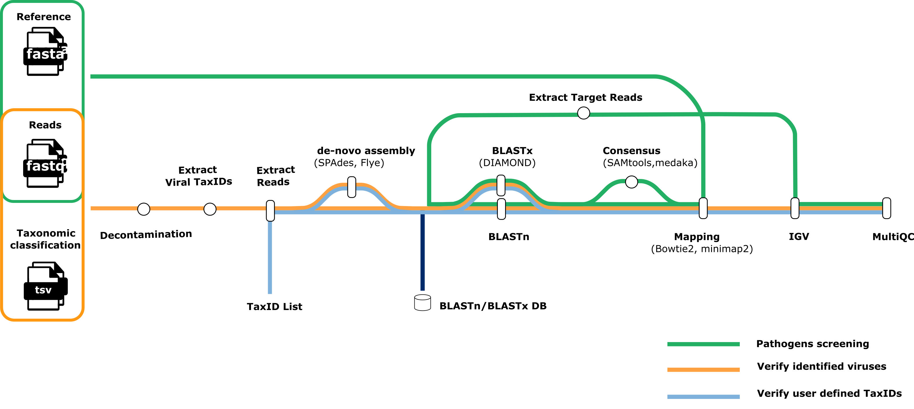

# genomic-medicine-sweden/metaval: Output

## Introduction

This document describes the output produced by the pipeline. Most of the plots are taken from the MultiQC report, which summarises results at the end of the pipeline.

The directories listed below will be created in the results directory after the pipeline has finished. All paths are relative to the top-level results directory.

<!-- TODO nf-core: Write this documentation describing your workflow's output -->

## Pipeline overview

The pipeline is built using [Nextflow](https://www.nextflow.io/) and processes data using the following steps:

- [FastQC](#fastqc) - Raw read QC
- [Extract Viral TaxIDs](#Extract-Viral-TaxIDs) - Extract all taxonomic IDs of viral species identified by classifiers
- [Extract Reads](#Extract-Reads) - Extract reads of a specific TaxID
- [De novo assembly](#De-novo-assembly) for extracted reads of TaxID
- [BLAST](#BLAST) - Run BLASTN or BLASTX
- [Bowtie2](#Mapping) - Map raw Illumina reads to a pathogen genome database or map Illumina reads of specific taxIDs to genomes with positive BLAST hits.
- [minimap2](#Mapping) - Map raw Nanopore reads to a pathogen genome database or map Nanopore reads of specific taxIDs to genomes with positive BLAST hits.
- [IGV](#IGV) - Report for visualizing reads mapped to the genomes identified.
- [Pathogen reads](#Pathogen-reads) For the pathogen screening workflow, prepare an individual FASTA/BAM file for each pathogen with mapped reads.
- [Call Consensus](#Call-Consensus) - Call consensus sequences for reads mapped to pathogen genomes
- [MultiQC](#multiqc) - Aggregate report describing results and QC from the whole pipeline
- [Pipeline information](#pipeline-information) - Report metrics generated during the workflow execution

### FastQC

Output files

- `fastqc/`
  - `*_fastqc.html`: FastQC report containing quality metrics.
  - `*_fastqc.zip`: Zip archive containing the FastQC report, tab-delimited data file and plot images.

[FastQC](http://www.bioinformatics.babraham.ac.uk/projects/fastqc/) gives general quality metrics about your sequenced reads. It provides information about the quality score distribution across your reads, per base sequence content (%A/T/G/C), adapter contamination and overrepresented sequences. For further reading and documentation see the [FastQC help pages](http://www.bioinformatics.babraham.ac.uk/projects/fastqc/Help/).

### Extract Viral TaxIDs

Extract all taxonomic IDs of viral species predicted by classifiers.

Output files

- `viral_taxids/`
  - `<sample_id>_centrifuge_viral_taxids.tsv`
  - `<sample_id>_diamond_viral_taxids.tsv`
  - `<sample_id>_kraken2_viral_taxids.tsv`

This directory will only be present if `--perform_verify_species` is supplied, while `--taxid` is not specified.

### Extract Reads

Retrieve the reads of all viral TaxIDs predicted by classifiers or extracts reads from a user-defined list of TaxIDs separated by spaces when the `--taxid` option is activated

Output files

- `extracted_reads/`
  - `centrifuge/`
    - `<sample_id>_taxid_<taxid>_<species>.extracted_centrifuge_read*.fa` : Reads assigned to certain TaxID by `Centrifuge`.
  - `diamond/`
    - `<sample_id>_taxid_<taxid>_<species>.extracted_diamond_read*.fa` : Reads assigned to certain TaxID by `DIAMOND`.
  - `kraken2/`
    - `<sample_id>_taxid_<taxid>_<species>.extracted_kraken2_read*.fa` : Reads assigned to certain TaxID by `Kraken2`.

The `extracted_reads` directory will only be present if `--perform_verify_species` is supplied. The `centrifuge` folder will only be present if `--extract_centrifuge_reads` is specified. Similarly, the `diamond` folder will appear only if `--extract_diamond_reads` is used, and the `kraken2` folder will be created only if `--extract_kraken2_reads` is activated.

### De novo assembly

Perform de novo assembly when the number of reads for a given taxID exceeds `params.min_read_counts`; otherwise skip it.

Output files

- `spades/`
  - `centrifuge/`
    - `<sample_id>_taxid_<taxid>_<species>.contigs.fa.gz`: FASTA file containing the resulting contigs generated by `SPAdes`.
    - `<sample_id>_taxid_<taxid>_<species>.scaffolds.fa.gz`: FASTA file containing the resulting scaffolds generated by `SPAdes`.
  - `diamond/`
    - `<sample_id>_taxid_<taxid>_<species>.contigs.fa.gz`: FASTA file containing the resulting contigs generated by `SPAdes`.
    - `<sample_id>_taxid_<taxid>_<species>.scaffolds.fa.gz`: FASTA file containing the resulting scaffolds generated by `SPAdes`.
  - `kraken2/`
    - `<sample_id>_taxid_<taxid>_<species>.contigs.fa.gz`: FASTA file containing the resulting contigs generated by `SPAdes`.
    - `<sample_id>_taxid_<taxid>_<species>.scaffolds.fa.gz`: FASTA file containing the resulting scaffolds generated by `SPAdes`.

- `flye/`
  - `*.fasta.gz`: Final assembly in fasta format generated by `Flye`.
  - `*.log`: Log file summarizing steps and intermediate results.

The `spades` directory will only be present if `--perform_shortread_denovo` is supplied and the number of reads for a taxID exceeds `params.min_read_counts`. The `centrifuge` folder will only be present if `--extract_centrifuge_reads` is specified. Similarly, the `diamond` folder will appear only if `--extract_diamond_reads` is used, and the `kraken2` folder will be created only if `--extract_kraken2_reads` is activated. Check out the [Spades documentation](https://ablab.github.io/spades/) for more information on Spades output.

The `flye` directory will only be present if `--perform_longread_denovo` is supplied and the number of reads for a taxID exceeds `params.min_read_counts`. The `centrifuge` folder will only be present if `--extract_centrifuge_reads` is specified. Similarly, the `diamond` folder will appear only if `--extract_diamond_reads` is used, and the `kraken2` folder will be created only if `--extract_kraken2_reads` is activated. Check out the [Flye documentation](https://github.com/fenderglass/Flye/blob/flye/docs/USAGE.md) for more information on Flye output.

### BLAST

Use `BLAST(N/X)` to identify the closest reference genomes for the target reads or consensus sequences. `BLAST(N/X)` could be run on:

- Extracted reads assigned to a specific taxID when the number of reads is below `params.min_read_counts`.
- Contigs or scaffolds from de novo assembly when the number of extracted reads for a given taxID exceeds `params.min_read_counts`.
- Reads mapped to a predefined pathogen database during `pathogen screening` when the number of mapped reads is below `params.min_read_counts`
- Consensus sequences mapped to a predefined pathogen database during the `pathogen screening` when the number of those mapped reads exceeds `params.min_read_counts`

#### Verify identified species

Run `BLAST(n/x)` on reads classified as viruses by `kraken2`, `Centrifuge` or `DIAMOND`, or on reads corresponding to a user-defined list of taxIDs.

Output files

- `blast/`
  - `blastn/`
    - `centrifuge/`
      - `<sample_id>_taxid_<taxid>_<species>_blast.txt`: `BLASTN` hits.
      - `<sample_id>_taxid_<taxid>_<species>_blast_filtered.txt`: Filtered `BLASTN` hits.
      - `<sample_id>_taxid_<taxid>_<species>_blast_filtered_summary.txt`: Summary of filtered `BLASTN` hits.
    - `diamond/`
      - `<sample_id>_taxid_<taxid>_<species>_blast.txt`: `BLASTN` hits.
      - `<sample_id>_taxid_<taxid>_<species>_blast_filtered.txt`: Filtered `BLASTN` hits.
      - `<sample_id>_taxid_<taxid>_<species>_blast_filtered_summary.txt`: Summary of filtered `BLASTN` hits.
    - `kraken2/`
      - `<sample_id>_taxid_<taxid>_<species>_blast.txt`: `BLASTN` hits.
      - `<sample_id>_taxid_<taxid>_<species>_blast_filtered.txt`: Filtered `BLASTN` hits.
      - `<sample_id>_taxid_<taxid>_<species>_blast_filtered_summary.txt`: Summary of filtered `BLASTN` hits.

  - `blastx/`
    - `centrifuge/`
      - `<sample_id>_taxid_<taxid>_<species>_blastx.txt`: `BLASTX` hits.
      - `<sample_id>_taxid_<taxid>_<species>_blastx_filtered.txt`: Filtered `BLASTX` hits.
    - `diamond/`
      - `<sample_id>_taxid_<taxid>_<species>_blastx.txt`: `BLASTX` hits.
      - `<sample_id>_taxid_<taxid>_<species>_blastx_filtered.txt`: Filtered `BLASTX` hits.
    - `kraken2/`
      - `<sample_id>_taxid_<taxid>_<species>_blastx.txt`: `BLASTX` hits.
      - `<sample_id>_taxid_<taxid>_<species>_blastx_filtered.txt`: Filtered `BLASTX` hits.
      - `<sample_id>_taxid_<taxid>_<species>_blastx_filtered_summary.txt`: Summary filtered `BLASTX` hits.

Users must provide a path to a `BLASTN` database using `params.blastn_db` and a `BLASTX` database using `params.blastx_db`. BLAST can also be skipped by setting `params.skip_blastn` or `params.skip_blastx`.

#### Pathogen screening

Run `BLAST(n/x)` on reads or consensus sequences mapped to a predefined pathogen database.

Output files

- `pathogens/`
  - `blast`
    - `blastn/`
      - `centrifuge/`
        - `<sample_id>_<species>.txt`: `BLASTN` hits.
        - `<sample_id>_<species>_filtered.txt`: Filtered `BLASTN` hits.
        - `<sample_id>_<species>_blast_filtered_summary.txt`: Summary of filtered `BLASTN` hits.
      - `diamond/`
        - `<sample_id>_<species>.txt`: `BLASTN` hits.
        - `<sample_id>_<species>_filtered.txt`: Filtered `BLASTN` hits.
      - `kraken2/`
        - `<sample_id>_<species>.txt`: `BLASTN` hits.
        - `<sample_id>_<species>_filtered.txt`: Filtered `BLASTN` hits.

    - `blastx/`
      - `centrifuge/`
        - `<sample_id>_<species>.txt`: `BLASTX` hits.
        - `<sample_id>_<species>_filtered.txt`: Filtered `BLASTX` hits.
      - `diamond/`
        - `<sample_id>_<species>.txt`: `BLASTX` hits.
        - `<sample_id>_<species>_filtered.txt`: Filtered `BLASTX` hits.
      - `kraken2/`
        - `<sample_id>_<species>.txt`: `BLASTX` hits.
        - `<sample_id>_<species>_filtered.txt`: Filtered `BLASTX` hits.

The `-outfmt` option is defined in `modules.config` as: ` -outfmt '10 qseqid sseqid slen pident qlen length qcovs nident evalue bitscore staxid ssciname'`. If you want to add or remove fields from the output, you need to update both `BLAST` output header file (`assets/blast_outfmt10_header.txt`) and the filtering function of `BLAST` hits (`bin/filter_blast.py`). Filtering thresholds can be adjusted using the parameters `params.blast(n/x)_min_qlen`, `params.blast(n/x)_min_pident`,`params.blast(n/x)_min_length`,`params.blast(n/x)_max_evalue`, which correspond to query length, percent of identical matches, alignment length, and e-value. The default values are 50, 50, 50 and 0.001.

### Mapping

Map Illumina short reads to genomes using `bowtie2` and map Nanopore long reads to genomes using `minimap2`

#### Verify identified species

Map reads to genomes based on BLAST hits or to genomes of identified species if the BLAST steps are skipped.(`params.skip_blastn` and `params.skip_blastx`).

Output files

- `mapping/`
  - `bowtie2/`
    - `align/`
      - `<sample_id>_<classifer>_taxid_<taxid>_<species>_mappingorganism_<organism>.bam`: BAM file containing short reads that were aligned against the genomes based on BLAST hits.
      - `<sample_id>_<classifer>_taxid_<taxid>_<species>_mappingorganism_<organism>.bam.bai`: Index of the bam file.
    - `build/`
      - `mappingorganism_<organism>/`
        - `bowtie2/*.bt2l`: Bowtie2 indices of genomes with BLAST hits
  - `minimap2/`
    - `align/`
      - `<sample_id>_<classifer>_taxid_<taxid>_<species>_mappingorganism_<organism>.bam`: BAM file containing long reads that were aligned against the user-supplied pathogens genomes
      - `<sample_id>_<classifer>_taxid_<taxid>_<species>_mappingorganism_<organism>.bam.bai`: Bam index file
    - `index/`
      - `mappingorganism_<organism>`
        - `*.mmi`: Minimap2 indices of the reference pathogens genomes

#### Pathogen screening

Map reads to the pathogen genomes databases.

Output files

- `pathogens/`
  - `mapping/`
    - `bowtie2/`
      - `align/`
        - `<sample_id>_aligned_pathogens_genome_sorted.bam`: BAM file containing short reads that aligned against the user-provided pathogens genomes
        - `<sample_id>_aligned_pathogens_genome_sorted.bam.bai`: Index of the bam file.
      - `build/`
        - `bowtie2/*.bt2l`: Bowtie2 indices of reference pathogens genomes
    - `minimap2/`
      - `align/`
        - `<sample_id>_aligned_pathogens_genome_sorted.bam`: BAM file containing long reads that aligned against the user-provided pathogens genomes
        - `<sample_id>_aligned_pathogens_genome_sorted.bam.bai`: Bam file index
      - `index/`
        - `*.mmi`: Minimap2 indices of reference pathogens genomes

The `pathogens` directory will only be present if `--perform_screen_pathogens` is supplied.

### IGV

Generate an IGV report to visualize the variants and coverage of mapped reads across genomes.

#### Verify identified species

IGV visualization of reads that classifiers assigned to specific species.

Output files

- `igv/`
  - `<sample_id>_<classifer>_taxid_<taxid>_<species>_mappingorganism_<organism>_report.html`: IGV report with variants and coverage of reads mapped to the genomes.

#### Pathogen screening

IGV visualization of reads mapped to pathogen genome database.

Output files

- `pathogens/`
  - `igv/`
    - `<sample_id>_<species>_report.html`: IGV report with the variants and coverage of reads mapped to the genomes.

The `IGV` directory will only be present if `perform_mapping` is provided.

### Pathogen reads

After mapping reads to the pathogen genome databases, the BAM file includes multiple pathogen genomes. So we need to prepare individual BAM or FASTA files for each pathogen with mapped reads for downstream `Call consensus` and `BLAST`.

Output files

- `pathogens/`
  - `pathogen_reads`
    - `consensus_input/`
      - `<sample_id>_<species>_sorted.bam`
      - `<sample_id>_<species>_sorted.bam.bai`
    - `blast_input/`
      - `<sample_id>_<species>.fasta.gz`

If the number of mapped reads to a pathogen genome exceeds `params.min_read_counts`, an individual BAM file will be created and placed in the `consensus_input` folder. Otherwise, an individual FASTA file will be created and placed in the `blast_input`folder.

### Call consensus

Call consensus sequences for Illumina reads mapped to pathogen genomes using `samtools`, and for Nanopore reads using either `samtools` or `medaka` if the number of mapped reads exceeds the `params.min_read_counts`.

Output files

- `pathogens/`
  - `consensus`
    - `<sample_id>_<species>.fasta`: Consensus sequences.

The `consensus` directory will only be created if `--perform_screen_pathogens` is supplied along with either `--perform_longread_consensus` or `--perform_shortread_consensus`.

### MultiQC

Output files

- `multiqc/`
  - `multiqc_report.html`: a standalone HTML file that can be viewed in your web browser.
  - `multiqc_data/`: directory containing parsed statistics from the different tools used in the pipeline.
  - `multiqc_plots/`: directory containing static images from the report in various formats.

[MultiQC](http://multiqc.info) is a visualization tool that generates a single HTML report summarising all samples in your project. Most of the pipeline QC results are visualised in the report and further statistics are available in the report data directory.

Results generated by MultiQC collate pipeline QC from supported tools e.g. FastQC. The pipeline has special steps which also allow the software versions to be reported in the MultiQC output for future traceability. For more information about how to use MultiQC reports, see <http://multiqc.info>.

### Pipeline information

Output files

- `pipeline_info/`
  - Reports generated by Nextflow: `execution_report.html`, `execution_timeline.html`, `execution_trace.txt` and `pipeline_dag.dot`/`pipeline_dag.svg`.
  - Reports generated by the pipeline: `pipeline_report.html`, `pipeline_report.txt` and `software_versions.yml`. The `pipeline_report*` files will only be present if the `--email` / `--email_on_fail` parameter's are used when running the pipeline.
  - Reformatted samplesheet files used as input to the pipeline: `samplesheet.valid.csv`.
  - Parameters used by the pipeline run: `params.json`.

[Nextflow](https://www.nextflow.io/docs/latest/tracing.html) provides excellent functionality for generating various reports relevant to the running and execution of the pipeline. This will allow you to troubleshoot errors with the running of the pipeline, and also provide you with other information such as launch commands, run times and resource usage.
